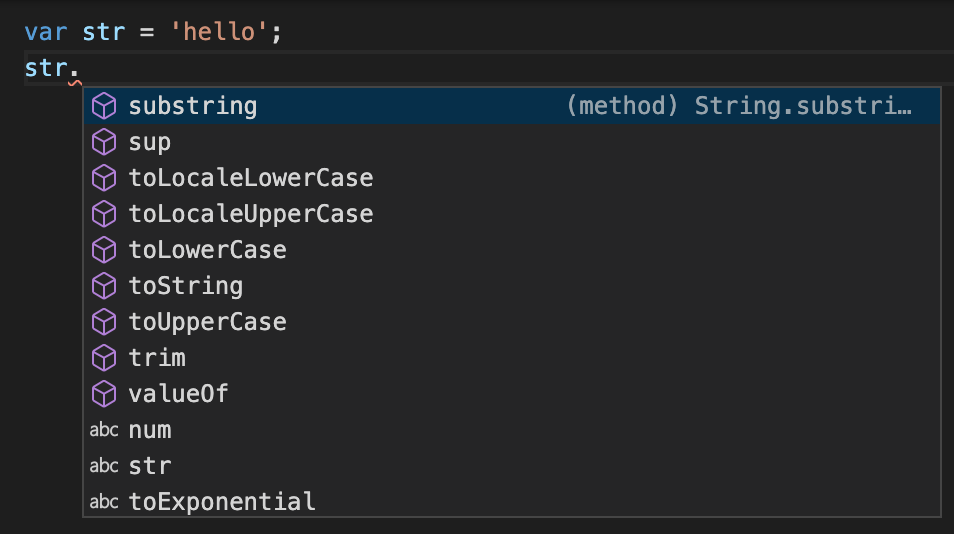

자바스크립트의 자료형은 크게 `원시 타입`과 `참조 타입`으로 나뉩니다.

---

## 원시 타입 (Primitive Type)

**원시 타입**은 모두 하나의 값을 담고 있습니다.  
- 문자(string)
- 숫자(number)
- bigint
- 불리언(boolean)
- null
- undefined
- 심볼(symbol) => ES6부터 추가된 타입


총 일곱 가지 입니다. 원시 자료형은 값 자체에 대한 변경이 불가능(immutable) 하지만, 변수에 데이터를 재할당할 수 있습니다. 하나의 메모리에 하나의 데이터를 보관합니다. 변수를 재할당 해도 변수의 항당 값에 영향을 주지 않습니다.

```javascript
let myString = 'goodNews';
myString = 'badNews'; // 재할당 가능

myString[0] = 'B'; // 원시 타입이기 때문에 BadNews로 변경 불가능. 오류는 Throw되지 않는다.
console.log(myString); // badNews

let myString2 = myString; // myString 값이 myString2에 그대로 복사되어 'badNews'가 할당된다.
console.log(myString2); // badNews

myString2 = 20;

console.log(myString); // badNews
console.log(myString2); // 20
```

---

## 참조 타입 (Reference Type)

**참조 타입**은 변수에 할당할 때에는 값이 아닌 '주소'를 저장합니다. 배열, 객체, 함수가 대표적입니다. 변수는 주소를 저장하고, 주소는 특별한 동적인 데이터 보관함에 보관되는데 이 데이터 보관함을 `메모리 힙` 이라고 합니다. 값을 재할당 할 경우 주소는 참조한 모든 값이 영향을 받습니다. 즉, 값이 공유됩니다.

```javascript
let obj = {
  a: 1,
  b: 2,
  c: 3
}

let newObj = obj;
newObj.a = 100; // 참조된 값 중 a의 값에 100을 재할당

console.log(obj.a); // 100
// 해당 주소를 참조한 newObj의 a값을 바꾸었기 때문에 두 객체 모두 반환하는 a 값이 변경됨.
```

---

## 원시 타입에서 메소드 호출

그럼 여기서 아래 코드를 보시면 의문점이 생길 수 있습니다.

```javascript
let thisIsPrimitive = 'hello world'; // 원시타입을 할당
console.log(thisIsPrimitive.toUpperCase()); //HELLO WORLD
```

위에서 언급한 `Primitive Type` 인 `string` 을 사용하였는데, 원시 타입임에도 메소드가 사용 가능한 것을 확인할 수 있다. vscode에서 원시 타입의 메소드를 사용하기 위해 `.`을 타이핑하면 아래와 같이 확인할 수 있다.



원시 타입(Primitive Type)에서 호출하는 메서드는 사실, 준 `빌트인 객체`인 Number, String, Boolean, Symbol에 정의된 메소드입니다. 원시 타입인 number, string, boolean, symbol에서 어떻게 표준 빌트인 객체에 정의된 메서드를 호출할 수 있는 걸까요?

---

## 래퍼 타입 (Wrapper Object)

▶ 원시 타입의 메서드를 호출하면,

1) 순간적으로 원시 타입에 해당하는 '객체'가 생성되고,
2) 이 '객체'의 메서드가 호출된다.
3) 메서드 처리가 끝나면 이 '객체'는 사라지고,
4) 원래의 원시 타입만 남는다.

순간적으로 생성되었다 사라지는 객체를 `래퍼 객체(Wrapper Object)` 라고 하는데, 자바스크립트 엔진이 암묵적으로 `원시 타입` 에 해당하는 `래퍼 객체` 를 생성하고, 볼일이 끝나면 다시 원시 타입으로 복귀시키는 것입니다. 그럼 그냥 애초에 객체(Number, String, Boolean, Symbol)로 생성하면 될 텐데, 자바스크립트는 왜 이런 방식을 쓰는 걸까요?

---

## 래퍼 객체의 존재 이유

1) 객체의 딜레마  
   객체는 다양한 프로퍼티와 메서드가 있어서 유용하지만, 무겁고 느리다는 단점이 있다.
2) 원시 타입의 딜레마  
   원시 타입은 가볍고 빠르지만, 그냥 값 하나뿐이라는 단점이 있다.
3) 해결책(?)  
   원시 타입을 그대로 쓰자! 대신, 메서드를 호출할 때만 잠깐 객체로 바꾸자.

**즉, 원시 타입의 가벼움은 유지하면서, 객체의 유용한 기능도 쓰기 위한 방법입니다. 따라서, 특별한 경우를 제외하면, 객체를 따로 생성할 필요 없이, 원시 타입을 그대로 사용하는 게 권장됩니다.**

> **원시 타입에서 사용 가능한 메소드**  
> 원시 타입에 해당하는 객체의 메소드를 모두 사용할 수 있습니다.
>
> number 타입 -> Number객체의 메소드 사용  
> string 타입 -> String객체의 메소드 사용  
> boolean 타입 -> Boolean객체의 메소드 사용  
> symbol 타입 -> Symbol객체의 메소드 사용

---

## 원시 타입의 null

자바스크립트의 null은 '의도적으로 값이 없음'을 명시하기 위한 값입니다. 타입도 null이며, 값도 null인 `Primitive Type` 입니다. 즉, null은 객체가 아닙니다. 하지만 아래 코드를 본다면 의문점이 생길 수 있습니다.

```javascript
console.log(typeof 'a'); // 'string'
console.log(typeof 1); // 'number'
console.log(typeof 123n); // 'bigint'
console.log(typeof true); // 'boolean'
console.log(typeof undefined); // 'undefined'
console.log(typeof Symbol('a')); // 'symbol'

console.log(typeof null); // object
```

다른 원시 타입은 전부 타입 체크 시 해당 타입으로 값이 출력되지만 오직 null 만 object 로 나오게 된다. object 는 Reference Type 인데 어떻게 된 것일까요? 원인은 조금 어이없게도 typeof 연산자의 버그입니다. 실제 typeof 연산자의 구현 코드에서 null을 체크하는 항목이 누락되어 있습니다. 그래서 typeof null 의 실행 결과가 object 가 되는 것입니다.

---

> **확실한 버그!**


결론부터 말씀드리면 typeof 연산자의 버그 수정 제안을 거절하였습니다. 현재는 다운된 wiki.ecmascript.org 에 등록되어 있는 내용 일부입니다.

> 결론 : 'Reject'(거절)  
> This proposal has been rejected.
>
> 이유 :  
> 이미 수많은 사이트들의 코드가 기존의 typeof로 작성되어 있어서, 고치면 위험합니다.  
> 이건 '하나의 자바스크립트'라는 정신에 맞지 않습니다.  
> It was implemented in V8 but it turned out that it broke a lot of existing sites.  
> In the spirit of One JavaScript this is not feasible.
>
> 원문 참고 : [archive.is/sPyGA#selection-107.1-107.169](https://archive.is/sPyGA#selection-107.1-107.169)

---

### null 타입 체크 방법

일치 연산자 `===` 을 쓰는 게 좋습니다. 일치 연산자는 값과 타입이 동일할 때에만 `true` 를 반환합니다.

```javascript
let test = null; 
console.log(test === null); // true
```

자바스크립트의 `null`은 객체가 아닌 원시 타입이며, 타입 체크는 일치 연산자(===)로 하는 게 좋다는 걸 기억해두면 좋겠습니다.