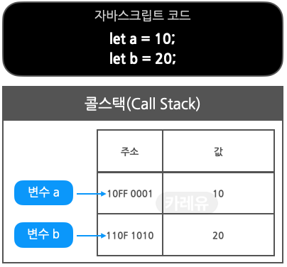

> **본 게시글은 [https://curryyou.tistory.com/276](https://curryyou.tistory.com/276) 을 참조하여 일부 내용을 수정, 추가 작성하였습니다.**


## 콜 스택, 메모리 힙이란?

자바스크립트 엔진은 `Memory Heap` 과 `Call Stack` 으로 구성되어 있습니다. 가장 유명한 것이 구글의 V8 Engine입니다. 자바스크립트는 단일 스레드 (sigle thread) 프로그래밍 언어인데, 이 의미는 `Call Stack이 하나` 라는 이야기입니다. 즉 멀티가 되지 않고, 하나씩 하나씩 처리한다는 의미입니다.

### 콜 스택(Call Stack)

원시 타입(숫자 등) 데이터가 저장된다.  
실행 콘텍스트(Execution Context)를 통해

1) 변수 식별자(이름) 저장,
2) 스코프 체인 및 this 관리,
3) 코드 실행 순서 관리 등을 수행.  
   \*실행 컨텍스트의 상세 구조 및 원리는 이 글의 범위를 넘어가므로 다루지 않습니다.

## 메모리 힙(Memory Heap)

참조 타입(객체 등) 데이터가 저장된다.  
메모리 할당이 일어나는 곳.

---

## 콜 스택, 메모리 힙의 데이터 저장 구조


### 1\. 원시 타입 데이터(파란색 변수 a)

- 10이라는 값 자체는 원시 타입이므로 콜 스택에 저장된다.  
- 변수 a에는 10이 저장된 콜 스택 메모리의 주소값이 저장된다.  
* 변수 식별자 a 자체는 콜스택 상의 '실행 컨텍스트(Execution Context)의 렉시컬 환경(Lexical Environment)'이라는 곳에 저장된다.

### 2\. 참조 타입 데이터(핑크색 변수 b, c, d)

- 배열, 객체, 함수 등은 참조 타입이므로 메모리 힙에 저장된다.  
- 참조타입 데이터가 저장된 메모리 힙의 주소값은 콜스택에 각각 저장된다.  
- 메모리힙의 주소 값이 저장된 콜 스택의 주소값은 각각 변수 b, c, d에 저장된다.  
* 마찬가지로, 변수 식별자 b, c, d 이름 자체는 콜스택 상의 '실행 컨텍스트(Execution Context)의 렉시컬 환경(Lexical Environment)'에 저장된다.

이제 좀 더 상세하게 원시 타입/참조 타입 데이터가 콜 스택과 메모리 힙에서 어떻게 관리되는지 정리해보겠습니다.

원시 타입과 참조 타입에 자세한 설명은 아래 주소에서 참고해주시면 되겠습니다.  
[https://charming-kyu.tistory.com/20](https://charming-kyu.tistory.com/20)

---

### 원시 타입의 변수 데이터

#### 1\. 원시타입 변수 생성



원시타입의 데이터 값은 `콜스택`에 저장되고, 데이터 값이 저장된 `콜스택`의 주소 값은 변수 a, b에 각각 저장됩니다.

#### 2\. 원시 타입 재할당 - Case 1


변수 a에 20을 재할당하면, 본인의 메모리에 있는 값을 변경하는 게 아니라, 기존에 20을 저장하고 있는 메모리의 주소 값으로 교체한다. a에 저장된 주소 값은 20을 가리키고 있던 b에 저장된 주소 값과 동일해집니다.

#### 3\. 원시 타입 재할당 - Case 3


변수 b에 30을 재할당하면, 변수 b의 주소 값이 가리키는 메모리에 저장된 20을 30으로 교체하는 게 아니라, 새로운 메모리를 확보하여 30을 저장하고, 변수 b에 저장된 주소 값을 해당 주소 값으로 교체합니다.

#### 4\. 가비지 컬렉터


더 이상 참조되지 않는 데이터는 `가비지 컬렉터` 에 의해 적절한 시점에 메모리에서 해제됩니다.

---

### 자바스크립트의 콜 스택과 힙 메모리

이번 포스팅의 목적 상, 자바스크립트의 메모리 모델은 `콜스택` 과 `힙` 이라는 명확히 구분된 두 가지 영역으로만 이루어져 있다고 생각해보겠습니다.


`콜스택` 은 `원시타입` 이 저장되는 공간입니다. (함수 호출도 이곳에 저장된다.)  
지금까지 예시를 들었던, 변수를 선언했을 때의 상황들을 대략적인 표현을 그림으로 보자면 다음과 같습니다.


각 변수의 값을 보여주기 위해, 메모리 주소를 생략했다. 그러나, 변수는 값을 가지고 있는 메모리 주소를 가리키고 있다는 사실을 잊으면 안 됩니다. 이 사실이 `let` 과 `const` 에 대한 이해의 핵심이 되는 내용이 됩니다.

이제, 힙을 살펴보겠습니다.  
**힙은 원시 타입이 아닌 타입들이 저장되는 공간입니다.**  
**힙은 갑자기 데이터가 커질 수도 있는, 배열과 객체와 같은 정렬되지 않은 데이터들을 저장할 수 있다는 점이 핵심 포인트입니다.**

---

### 자바스크립트의 참조 타입의 변수 선언과 할당

자바스크립트의 참조 타입은 원시 타입과는 다르게 동작합니다. 간단한 예부터 살펴보겠습니다. 아래에서는 `myArray` 라는 변수를 선언하고 빈 배열로 초기화합니다.

```javascript
let array = [];
```

`myArray` 변수를 선언하고 ”\[\]“같은 참조 타입을 할당했을 때, 다음과 같은 일들이 메모리에서 일어나게 됩니다.

1. 변수의 고유 식별자를 생성합니다.(“myArray”)  
2. 콜 스택의 메모리에 주소를 할당합니다.(런타임에 할당될 것입니다.)  
3. 힙에 할당된 메모리 주소를 콜스택의 값(value)으로 저장합니다.(런타임에 할당될 것입니다.)  
4. 힙의 메모리 주소에 할당된 값(빈 배열 \[\])을 저장합니다.


여기에서, `push` 나 `pop` 같은 메소드를 수행할 수 있습니다.

```javascript
array.push("first");
array.push("second");
array.push("third");
array.push("fourth");
array.pop();
```


---

### let 과 const

일반적으론, 가능한 한 `const` 를 사용해야 하며 변수가 변경될 거란 사실을 알 때만 `let` 을 사용해야 합니다. 이 변경이라는 게 무슨 의미인지 명확히 짚고 넘어갑시다. 가장 큰 오해는, 이 변경을 값(value)의 변경으로 해석하는 것입니다. 변경의 의미를 오해하고 있는 자바스크립트 개발자는 다음과 같은 코드를 작성할 수 있습니다.

```javascript
let sum = 0;
sum = 1 + 2 + 3 + 4 + 5;

let numbers = [];
numbers.push(1);
numbers.push(2);
numbers.push(3);
numbers.push(4);
numbers.push(5);
```

이 개발자는 값이 변경될 것임을 알았기에, `let` 을 사용하여 “sum”을 올바르게 표현했습니다. 그러나 `push` 메소드를 사용하여 배열에 무언가를 넣는 행위를, 값이 변경됨으로 해석해버려서 `let` 을 사용하여 변수를 선언하는 실수를 저질렀습니다.  
**“변경”이란, 메모리 주소의 변경을 의미합니다.**  
**let 은 메모리 주소를 변경을 허락합니다.**  
**const 는 메모리 주소를 변경할 수 없습니다.**

```javascript
const importantID = 489
importantID = 100 // TypeError: Assignment to constant variable
```

무슨 일이 일어났는지 시각화해봅시다.  
`importantID` 가 선언되면, 메모리 주소가 할당되고, 489라는 값(value)이 저장됩니다.  
변수 `importantID` 는 **메모리 주소와 같다는 점**을 잊지 마세요.


100이라는 값이 `importantID` 에 할당되면, 100은 원시 타입이기 때문에 새로운 메모리 주소가 할당되고, 100이라는 값(value)이 그 메모리 주소에 저장됩니다. 그리고 자바스크립트는 그 새로운 메모리 주소를 `importantID` 에 할당하려고 시도하며 이 부분에서 에러가 발생합니다. `const` 를 사용해서 변수를 선언했다는 의미는 `importantID` 의 ID가 변하는 것을 원하지 않았다는 뜻이기에, 위 상황은 우리가 원하는 대로 동작하고 있다고 볼 수 있습니다.


`importantID` 에 100을 할당하면, 실제로 100이 저장된 새로운 메모리 주소를 `importantID` 에 할당하려고 합니다. 하지만 `importantID` 는 `const` 로 선언되었기 때문에 허용되지 않습니다. 만약 아래와 같이 실행되면 어떻게 될까요?

```javascript
const myArray = [];
myArray.push(1);
myArray.push(2);
myArray.push(3);
myArray.push(4);
myArray.push(5);
```


`push` 메소드는 힙에 존재하는 배열에 숫자를 밀어 넣습니다. 그러나, 변수 `myArray의` 메모리 주소는 변경되지 않습니다. 이것이 `myArray` 가 `const로` 선언되었지만 에러가 발생하지 않는 이유입니다. `myArray는` 여전히 “0458 AFCZX91”라는 메모리 주소와 같으며, “0458 AFCZX91”는 힙의 배열을 값(value)으로 가지는 “22 VVCX011”를 값(value)으로 가지고 있습니다.

하지만 다음과 같이하면 에러가 발생합니다.

```javascript
myArray = 3;
```

숫자 3은 원시 타입이기 때문에 콜 스택의 메모리 주소가 할당되고, 3이라는 값이 저장되며, 그러고 나서 이렇게 생긴 새로운 메모리 주소를 `myArray` 에 할당하려고 합니다. 그러나 `myArray` 는 `const` 로 선언되었기 때문에 이러한 과정은 허용되지 않습니다.


**오류를 발생시키는 또 다른 예시**

```javascript
myArray = ['a'];
```

['a'] 는 참조 타입인 배열이므로 콜 스택에 새로운 메모리 주소가 할당되고, 콜스택 메모리 주소의 값(value)으로 힙 메모리 주소가 저장되며, 힙 메모리 주소의 값(value)은 \[‘a’\]입니다. 그런 다음 콜스택 메모리 주소를 `myArray` 에 할당하려 하면, 오류가 발생합니다.


`const` 로 선언된 객체의 경우에도 배열과 마찬가지로 참조 타입이므로, key값을 추가하고 프로퍼티를 업데이트하는 등의 작업을 수행할 수 있습니다.

```javascript
const myObj = {};
myObj["newKey"] = "someValue"; // this will not throw an error
```

---

> **1\. 모든 지역 변수를 const나 let으로 선언해라.**
>
> **2\. 변수를 재할당하지 않는 한, 기본적으로 const를 사용해라.**
>
> **3\. var 키워드는 절대 사용하지 마라.**

세계 최고의 개발자들이 일하고 있는 구글의 자바스크립트 스타일 가이드에는 위와 같은 내용이 있습니다. 비록 왜 저렇게 사용해야 하는지 이유가 적혀있지는 않지만, 제가 몇 가지 이유들을 설명해드릴 수 있습니다.

> **1\. 미래의 버그를 사전에 방지한다.**
>
> **2\. const 를 통해 선언된 변수는 반드시 선언과 동시에 초기화되어야 하며, 이를 통해 개발자는 스코프적인 측면에서 더욱 신중하게 변수를 배치해야 함을 강요받게 됩니다. 이는 궁극적으로 더 나은 메모리 관리 및 성능으로 이어지게 됩니다.**
>
> **3\. 단지 코드를 보는 것만으로도 어떤 변수가 변경 불가능하고, 또 어떤 변수가 재할당이 가능한지 의사소통할 수 있기 때문입니다.**

지금까지의 설명이 여러분들에게 `const` 와 `let` 을 언제, 그리고 왜 사용해야 할지 결정하는데 도움이 되기를 바랍니다.

참고 문헌:

[https://google.github.io/styleguide/jsguide.html](https://google.github.io/styleguide/jsguide.html)  
[https://blog.bitsrc.io/master-javascript-call-by-sharing-parameter-passing-7049d65163ed](https://blog.bitsrc.io/master-javascript-call-by-sharing-parameter-passing-7049d65163ed)  
[https://blog.sessionstack.com/how-javascript-works-memory-management-how-to-handle-4-common-memory-leaks-3f28b94cfbec](https://blog.sessionstack.com/how-javascript-works-memory-management-how-to-handle-4-common-memory-leaks-3f28b94cfbec)
