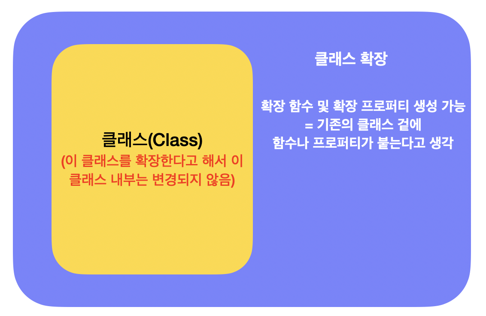

### **코틀린 확장 함수**

코틀린은 기존 클래스에 메소드를 추가할 수 있습니다.  
이를 **확장 함수**라고 합니다.

하지만 기존 클래스에 대해 메소드를 확장적으로 선언을 할 수 있을 뿐,  
해당 클래스의 구현부를 바꿀 수는 없습니다.  
**기존 클래스는 그대로 두고 클래스 주변에 새로운 함수를 추가하여 클래스의 크기를 확장한다.**  
라고 생각하면 좋을 것 같습니다.



String 클래스의 메소드인것 처럼 사용할 수 있는 lastChar 메소드를 확장해보겠습니다.  
확장 함수의 선언 방법은 아래와 같습니다.

```kotlin
fun String.lastChar():Char = this.get(this.length - 1)

// this 생략 가능
fun String.lastChar():Char = get(length - 1)

// 사용시
println("Charming".lastChar()) // "g"
```

-   String.lastChar() 중 **String**을 **수신 객체 타입**(receiver type)이라고 합니다.
-   **lastChar()**은 **확장 함수의 이름이**고, **Char**는 **반환 타입**입니다.
-   구현부인 **this.get(this.length - 1)** 중 **this**를 **수신 객체**(receiver object)라고 합니다.
-   확장 함수의 블럭 안에서는 **this.get()** 처럼 원래 가지고 있는 메소드를 호출할 수 있으며  
    **this**는 **생략**할 수 있습니다.
-   단, **private, protected 접근 제어자**로 선언되어 있는 메소드는 확장 함수에서 **호출할 수 없습니다.**

제네릭을 이용하면 더 유연하고 안정적인 확장 함수를 만들 수 있습니다.

```kotlin
// String 제네릭
fun Collection<String>.join(
  separator: String = ",",
  prefix: String = "(",
  postfix: String = ")"
): String {
  // ...
}

fun main() {
  val stringList = listof("1", "2", "3", "4")
  println(stringList.join()) // (1,2,3,4)
  
  val intList = listOf(1, 2, 3, 4)
  println(intlist.join()) // Int 타입은 불가능
}
```

### **확장 함수 오버라이드**

확장 함수는 static 메소드이고 클래스 밖에 선언되기 때문에 **오버라이드 할 수 없습니다.**

```kotlin
open class Animal(age: Int)
fun Animal.eat() {
  println("Animal Eat")
}

class Dog(age: Int, name: String) : Animal(age)
fun Dog.eat() {
  println("Dog Eat")
}

fun main() {
  val choco: Animal = Dog(3, "choco")
  choco.eat() // Animal Eat
}
```

위와 같이 Animal을 상속받은 Dog가 있습니다.  
Animal과 Dog 클래스는 eat()이라는 확장 함수를 가지고 있습니다.  
하지만 확장 함수는 static 메소드이기 때문에 Dog 클래스임에도 불구하고 Animal의 확장 함수가 실행되었습니다.

### **중복된 확장 함수**

확장 함수의 이름이 중복될 경우 import 할 때 이름을 변경할 수 있습니다.

```kotlin
// StringJoin.kt
package com.charming.learn.kotlin.function.other
fun String.lastChar():Char = this.get(this.length - 1)


// ExtendFunction.kt
package com.charming.learn.kotlin.function.extend
fun String.lastChar():Char = this.get(this.length - 1)
```

위 처럼 **StringJoin.kt** 와 **ExtendFunction.kt**에서 같은 이름으로 선언되어 있는 확장 함수인 lastChar() 를 사용할때  
"... cannot be invoked as a function." 라는 에러가 발생합니다.

이럴 경우 import 할 때 **as** 키워드를 이용하여 해결할 수 있습니다.

```kotlin
import com.charming.learn.kotlin.function.other.lastChar
import com.charming.learn.kotlin.function.extend.lastChar as last // last 로 이름을 변경

//확장 함수 사용
"charming".lastChar() // other 패키지에 있는 lastChar() 사용
"charming".last() // extend 패키지에 있는 lastChar() 사용
```

### **확장 프로퍼티**

클래스의 프로퍼티도 확장할 수 있습니다.  
다만, 확장 프로퍼티는 상태를 저장할 수 없기 때문에 초기화할 수 없고 **get()**을 구현해야합니다.

그리고 가변적으로 변할 수 있는 클래스의 프로퍼티의 경우 get()과 set()을 추가할 수 있습니다.  
**(var로 선언해야 함)**

```kotlin
// 확장 프로퍼티 선언
val String.lastChar: Char
  get() = get(length - 1)

// 가변적인 확장 프로퍼티의 경우 var로 선언
var StringBuilder.lastChar: Char
  get() = get(length - 1)
  set(value: Char) {
  	this.setCharAt(length - 1, value)
  }


fun main() {
  println("Charming".lastChar) // g
  
  val sb = StringBuilder("Charming?")
  sb.lastChar = '!'
  println(sb) // charming!
}
```
