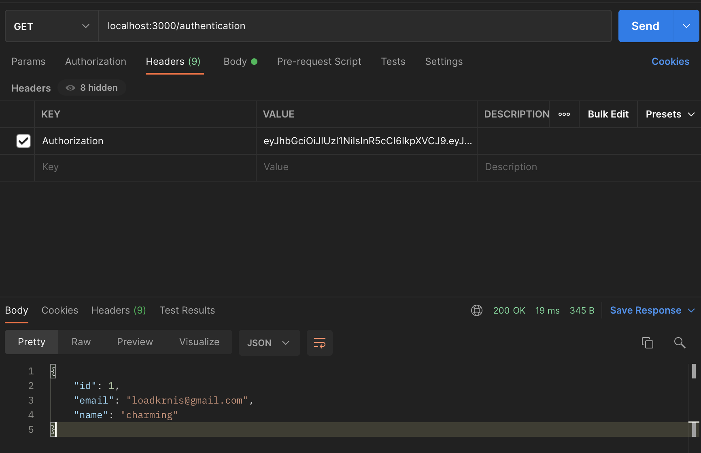

사용자 인증/인가는 모든 웹 애플리케이션에서 가장 중요한 부분입니다.  
이전 포스트에서는 Node.js를 이용하여 JWT로그인을 구현했습니다.

 [\[node.js\] JWT 구현 예제

Intro 웹 / 앱 개발을 하면 로그인 과정에서 반드시 만나게 되는 개념이 쿠키-세션이다. 최근 들어 IT 인프라 구성에는 많은 변화가 생겼다. 웹 기반의 서비스들은 웹과 앱을 함께 서비스하

charming-kyu.tistory.com](https://charming-kyu.tistory.com/4)

이번에는 NPM 라이브러리에서 가장 많이 사용되는 **Passport**를 이용하여 NestJS 애플리케이션에 로그인을 구현해보겠습니다.  
또한 **해싱(Hashing)**을 통해 사용자를 등록하고 비밀번호를 안전하게 암호화하여 보호하겠습니다.

## User Entity

인증을 고려할 때 가장 먼저 해야 할 일은 사용자 Entity를 정의하는 것입니다.

**users/user.entity.ts**

```
import { Column, Entity, PrimaryGeneratedColumn } from 'typeorm';

@Entity()
class User {
  @PrimaryGeneratedColumn()
  public id?: number;

  @Column({ unique: true })
  public email: string;

  @Column()
  public name: string;

  @Column()
  public password: string;
}

export default User;
```

email을 **unique**로 지정하여 동일한 이메일을 사용하는 두 명의 사용자가 존재하는 것을 방지합니다.   
이제 선언한 User 엔티티에 대해 몇 가지 작업을 수행하기 위해 **Service**를 생성하겠습니다.

**users/users.service.ts**

```
import { HttpException, HttpStatus, Injectable } from '@nestjs/common';
import { InjectRepository } from '@nestjs/typeorm';
import { Repository } from 'typeorm';
import User from './user.entity';
import CreateUserDto from './dto/createUser.dto';

@Injectable()
export class UsersService {
  constructor(
    @InjectRepository(User)
    private usersRepository: Repository<User>,
  ) {}

  async getByEmail(email: string) {
    const user = await this.usersRepository.findOne({ email });
    if (user) {
      return user;
    }
    throw new HttpException(
      '사용자 이메일이 존재하지 않습니다.',
      HttpStatus.NOT_FOUND,
    );
  }

  async create(userData: CreateUserDto) {
    const newUser = await this.usersRepository.create(userData);
    await this.usersRepository.save(newUser);
    return newUser;
  }
}
```

**users/dto/createUser.dto.ts**

```
export class CreateUserDto {
  email: string;
  name: string;
  password: string;
}
export default CreateUserDto;
```

**users/users.module.ts**

```
import { Module } from '@nestjs/common';
import { UsersService } from './users.service';
import { TypeOrmModule } from '@nestjs/typeorm';
import User from './user.entity';

@Module({
  imports: [TypeOrmModule.forFeature([User])],
  providers: [UsersService],
  exports: [UsersService],
})
export class UsersModule {}
```

## 비밀번호 암호화

사용자 회원가입에서 중요한 점은 비밀번호를 일반 텍스트로 저장하면 안된다는 것입니다.  
언제든지 데이터베이스가 공격받아 노출될 수 있습니다.

비밀번호를 더 안전하게 만들기 위해 암호를 **해싱**합니다.  
해싱 알고리즘은 단반향 암호화에 포함됩니다. 무조건 암호화만 수행할 수 있습니다. (복호화 불가)  
즉, 복호화는 불가능 하다는 것입니다.  
  
단방향 암호화의 자세한 내용은  
Django 단방향 암호화 패스워드 저장 방식을 Node.js를 이용하여 구현한 해당 글을 참조하시면 좋을 것 같습니다.

 [\[node.js\] crypto를 이용한 Django 패스워드 저장방식 PBKDF2 알고리즘 구현하기

구현하게 된 이유 현재 API서버는 Django로 만들어진 서버를 이용해 사용자의 아이디와 패드워드를 저장하고 있었다. 하지만 Django API서버의 기능 전부를 Node.js로 전환을 하고 있었다. 그러기 위해

charming-kyu.tistory.com](https://charming-kyu.tistory.com/10?category=993927)

### bcrypt

우리는 [bcrypt](https://www.npmjs.com/package/bcrypt) 에서 구현된 bcrypt 해싱 알고리즘을 사용합니다. 문자열을 해싱하고 솔트(salt)를 추가하는 작업을 처리합니다.

bcrypt를 사용하면 CPU에 집중적인 작업이 될 수 있습니다.  
다행히 bcrypt는 추가 스레드에서 실행할 수 있는 스레드 풀을 사용합니다.  
덕분에 우리 애플리케이션은 해싱을 하는 동안 다른 작업을 수행할 수 있습니다.

```
npm install @types/bcrypt bcrypt
```

bcrypt를 사용할 때 소금을 뿌릴 횟수를 정해야합니다.  
salt는 1씩 증가할 때마다 시간은 2배씩 증가합니다. 즉, 많이 뿌릴수록 비용으로 직결됩니다.  
그래서 저희 애플리케이션은 10번의 salt만 적용하겠습니다.

```
const passwordInPlaintext = '12345678';
const hash = await bcrypt.hash(passwordInPlaintext, 10);

const isPasswordMatching = await bcrypt.compare(
  passwordInPlaintext,
  hashedPassword,
);

console.log(isPasswordMatching); // true
```

## AuthenticationService

위의 모든 지식을 바탕으로 기본 등록 및 로그인 기능 구현을 시작할 수 있습니다.   
그러기 위해서는 먼저 Authentication Service를 정의해야 합니다.

**authentication/authentication.service.ts**

```
import { HttpException } from '@nestjs/common';

export class AuthenticationService {
  constructor(private readonly usersService: UsersService) {}

  public async register(registrationData: RegisterDto) {
    const hashedPassword = await bcrypt.hash(registrationData.password, 10);
    try {
      const createdUser = await this.usersService.create({
        ...registrationData,
        password: hashedPassword,
      });
      createdUser.password = undefined;
      
      return createdUser;
    } catch (error) {
      if (error?.code === PostgresErrorCode.UniqueViolation) {
        throw new HttpException(
          '사용자 이메일은 이미 존재합니다.',
          HttpStatus.BAD_REQUEST,
        );
      }
      throw new HttpException(
        '알 수 없는 오류가 발생했습니다.',
        HttpStatus.INTERNAL_SERVER_ERROR,
      );
    }
  }
  // (…)
}
```

> createdUser.password = undefined는 응답으로 암호를 보내지 않는 좋은 방법은 아닙니다.  
> 뒤에서 해당 로직을 깔끔하게 처리하게 도와주는 로직을 알아보겠습니다.

해시를 만들어 나머지 데이터와 함께 **usersService.create** 메서드에 전달합니다.   
실패할 수 있는 경우가 있기 때문에 여기 에서 try ... catch 문으로 묶었습니다.  
해당 이메일을 가진 사용자가 이미 존재하는 경우 **usersService.create** 메소드에서 오류가 발생합니다.  
고유한 열의 경우 Postgres에서 오류가 발생합니다.

[PostgreSQL 오류 코드 문서 페이지](https://www.postgresql.org/docs/9.2/errcodes-appendix.html)에서 **unique\_violation**의 코드는 **23505**입니다.  
깔끔하게 처리하기 위해 enum을 선언하겠습니다.

**database/postgresErrorCodes.enum.ts**

```
enum PostgresErrorCode {
  UniqueViolation = '23505'
}
```

> Service에서 이 이메일을 가진 사용자가 이미 존재한다고 명시하지만  
> 공격자가 등록된 이메일 목록을 얻기 위해 API를 무차별 대입할 수 있기 때문에  
> 그것을 방지하는 메커니즘을 구현하는 것이 좋습니다.

이제 로그인 구현만 남았습니다.

**authentication/authentication.service.ts**

```
export class AuthenticationService {
  constructor(private readonly usersService: UsersService) {}
  // (…)
  public async getAuthenticatedUser(email: string, hashedPassword: string) {
    try {
      const user = await this.usersService.getByEmail(email);
      const isPasswordMatching = await bcrypt.compare(
        hashedPassword,
        user.password,
      );
      if (!isPasswordMatching) {
        throw new HttpException(
          '잘못된 인증 정보입니다.',
          HttpStatus.BAD_REQUEST,
        );
      }
      user.password = undefined;

      return user;
    } catch (error) {
      throw new HttpException(
        '잘못된 인증 정보입니다.',
        HttpStatus.BAD_REQUEST,
      );
    }
  }
}
```

위의 중요한 점은 이메일이나 비밀번호가 틀리더라도 동일한 오류를 반환한다는 것입니다.   
그렇게 하면 데이터베이스에 등록된 이메일 목록을 가져오는 것을 목표로 하는 일부 공격을 방지할 수 있습니다.

위의 코드에 대해 개선하고 싶은 한 가지 작은 것이 있습니다.   
logIn 메서드 내에서 예외를 throw한 다음 로컬에서 catch합니다.  
혼란스럽게 여겨질 수 있습니다.  
비밀번호를 확인하는 별도의 방법을 만들어 보겠습니다.

```
public async getAuthenticatedUser(email: string, plainTextPassword: string) {
  try {
    const user = await this.usersService.getByEmail(email);
    await this.verifyPassword(plainTextPassword, user.password);
    user.password = undefined;
    return user;
  } catch (error) {
    throw new HttpException('잘못된 인증 정보입니다.', HttpStatus.BAD_REQUEST);
  }
}

private async verifyPassword(plainTextPassword: string, hashedPassword: string) {
  const isPasswordMatching = await bcrypt.compare(
    plainTextPassword,
    hashedPassword
  );
  if (!isPasswordMatching) {
    throw new HttpException('잘못된 인증 정보입니다.', HttpStatus.BAD_REQUEST);
  }
}
```

## Passport

우리는 수동으로 전체 인증 프로세스를 처리했습니다.  
[NestJS 공식문서](https://docs.nestjs.com/techniques/authentication)는 Passport 라이브러리 사용을 제안하고 그렇게 하는 수단을 제공합니다.  
Passport는 인증에 대한 추상화를 제공하여 무거운 짐을 덜어줍니다.  
또한 많은 개발자에 의해 프로덕션 환경에서 사용되고 있습니다.

애플리케이션 마다 JWT, Session 등 인증에 대한 접근 방식이 다릅니다.  
Passport는 이러한 메커니즘을 **전략(Strategy)**라고 부릅니다.  
우리가 구현하고자 하는 첫 번째 전략은 passport-local 전략(strategy)입니다.  
사용자를 아이디와 비밀번호로 인증하는 전략입니다.

```
npm install @nestjs/passport passport @types/passport-local passport-local @types/express
```

전략을 구성하려면 특정 전략에 특정한 옵션을 제공해야합니다.  
NestJS에서는 PassportStrategy Class를 **상속**하여 이를 수행합니다.

**authentication/local.strategy.ts**

```
import { Strategy } from 'passport-local';
import { PassportStrategy } from '@nestjs/passport';
import { Injectable } from '@nestjs/common';
import { AuthenticationService } from './authentication.service';
import User from '../users/user.entity';

@Injectable()
export class LocalStrategy extends PassportStrategy(Strategy) {
  constructor(private authenticationService: AuthenticationService) {
    super({
      usernameField: 'email',
    });
  }
  async validate(email: string, password: string): Promise<User> {
    return this.authenticationService.getAuthenticatedUser(email, password);
  }
}
```

모든 전략에 대해 Passport는 그에 맞는 유효성을 검증합니다.  
로컬 전략의 경우 Passport에는 사용자 이름과 암호가 있는 메서드를 오버라이드 해야합니다.  
우리의 경우 이메일이 사용자의 아이디 역할을 합니다.

또한 Passport를 사용하도록 AuthenticationModule을 구성해야 합니다.

**authentication/authentication.module.ts**

```
import { Module } from '@nestjs/common';
import { AuthenticationService } from './authentication.service';
import { UsersModule } from '../users/users.module';
import { AuthenticationController } from './authentication.controller';
import { PassportModule } from '@nestjs/passport';
import { LocalStrategy } from './local.strategy';

@Module({
  imports: [UsersModule, PassportModule],
  providers: [AuthenticationService, LocalStrategy],
  controllers: [AuthenticationController],
})
export class AuthenticationModule {}
```

## passport-local Guard 사용

위의 모듈은 AuthenticationController를 사용합니다.

아래에서는 [Guards](https://docs.nestjs.com/guards) 를 사용 합니다.   
Guard는 경로 핸들러가 요청을 처리하는지 여부를 결정하는 역할을 합니다.   
본질적으로 Express.js 미들웨어와 유사 하지만 더 강력합니다.

**authentication/authentication.controller.ts**

```
import {
  Body,
  Controller,
  HttpCode,
  Post,
  Req,
  UseGuards,
} from '@nestjs/common';
import { AuthenticationService } from './authentication.service';
import RegisterDto from './dto/register.dto';
import RequestWithUser from './requestWithUser.interface';
import { LocalAuthenticationGuard } from './localAuthentication.guard';

@Controller('authentication')
export class AuthenticationController {
  constructor(private readonly authenticationService: AuthenticationService) {}
  @Post('register')
  async register(@Body() registrationData: RegisterDto) {
    return this.authenticationService.register(registrationData);
  }
  @HttpCode(200)
  @UseGuards(LocalAuthenticationGuard)
  @Post('log-in')
  async logIn(@Req() request: RequestWithUser) {
    const user = request.user;
    user.password = undefined;
    return user;
  }
}
```

> 위에서 NestJS 는 기본적으로 POST 요청에 대해 201 Created 로 응답하기 때문에  
> @HttpCode(200)를 사용합니다.

**authentication/localAuthentication.guard.ts**

```
import { Injectable } from '@nestjs/common';
import { AuthGuard } from '@nestjs/passport';

@Injectable()
export class LocalAuthenticationGuard extends AuthGuard('local') {}
```

**authentication/requestWithUser.interface.ts**

```
import { Request } from 'express';
import User from '../users/user.entity';

interface RequestWithUser extends Request {
  user: User;
}
export default RequestWithUser;
```

authentication.controller.ts에서  
**@UseGuards(LocalAuthenticationGuard)  
**라고 작성한 코드 덕분에 \[POST\] /log-in 엔드포인트는 Passport에서 처리됩니다.  
Passport에서 처리가 완료되면 User의 데이터는 Request 객체에 포함됩니다.  
그래서 원활한 타입추론을 위해 Request를 상속받은 인터페이스를 선언합니다.

사용자가 성공적으로 인증되면 데이터를 반환합니다. 그렇지 않으면 오류가 발생합니다.

## JWT

우리는 미인증 사용자에게 애플리케이션의 일부를 제한하는 것을 목표로 합니다.  
이렇게 하면 인증된 사용자만 액세스할 수 있습니다.  
우리는 그들이 모든 요청에 ​​대해 인증을 받아야 하는 것을 원하지 않습니다.  
대신 사용자가 이미 성공적으로 로그인했음을 알 수 있는 방법이 필요합니다.

그렇게 하는 간단한 방법은 JSON 웹 토큰을 사용하는 것입니다.   
JWT 는 비밀 키를 사용하여 서버에서 생성된 문자열이며 우리만 해독할 수 있습니다.   
모든 요청에 ​​대해 다시 보낼 수 있도록 로그인할 때 사용자에게 제공하고 싶습니다.   
토큰이 유효하면 사용자의 신원을 신뢰할 수 있습니다.  
JWT의 자세한 내용은 아래 글을 확인하시면 좋습니다.

 [\[node.js\] JWT 구현 예제

Intro 웹 / 앱 개발을 하면 로그인 과정에서 반드시 만나게 되는 개념이 쿠키-세션이다. 최근 들어 IT 인프라 구성에는 많은 변화가 생겼다. 웹 기반의 서비스들은 웹과 앱을 함께 서비스하

charming-kyu.tistory.com](https://charming-kyu.tistory.com/4)

```
npm install @nestjs/jwt passport-jwt @types/passport-jwt cookie-parser @types/cookie-parser
```

가장 먼저 할 일은 JWT\_SECRET 및 JWT\_EXPIRATION\_TIME이라는 두 개의 새 환경 변수를 추가하는 것입니다.

모든 문자열을 JWT 비밀키로 사용할 수 있습니다.   
비밀키는 애플리케이션에서 토큰을 인코딩 및 디코딩하는 데 사용합니다.  
절대 유출되지 않는 것이 중요합니다.

보안을 강화하기 위해 만료 시간을 초 단위로 설명합니다.   
클라이언트의 토큰이 도난당한 경우 공격자는 암호를 갖는 것과 유사한 방식으로 애플리케이션에 액세스할 수 있습니다.  
만료 시간으로 인해 토큰이 만료되기 때문에 문제가 부분적으로 처리됩니다.

**app.module.ts**  

```
ConfigModule.forRoot({
  validationSchema: Joi.object({
    //…
    JWT_SECRET: Joi.string().required(),
    JWT_EXPIRATION_TIME: Joi.string().required(),
  }),
});
```

## 토큰 생성

이번에는 사용자가 JWT를 브라우저 쿠키에 저장하기를 구현하겠습니다.  
HttpOnly라는 명력 덕분에 웹 저장소에 토큰을 저장하는 것보다 특정 이점이 있습니다.  
브라우저에서 JavaScript를 통해 직접 액세스할 수 없기 때문에 [cross-site-scripting](https://owasp.org/www-community/attacks/xss/) 과 같은 공격에 대해 더 안전합니다.

> 쿠키에 대해 더 알고 싶다면 [여기](https://wanago.io/2018/06/18/cookies-explaining-document-cookie-and-the-set-cookie-header/)를 확인시면 좋습니다.

이제 JwtModule을 구성해 보겠습니다.

**authentication/authentication.module.ts**

```
import { Module } from '@nestjs/common';
import { AuthenticationService } from './authentication.service';
import { UsersModule } from '../users/users.module';
import { AuthenticationController } from './authentication.controller';
import { PassportModule } from '@nestjs/passport';
import { LocalStrategy } from './local.strategy';
import { JwtModule } from '@nestjs/jwt';
import { ConfigModule, ConfigService } from '@nestjs/config';

@Module({
  imports: [
    UsersModule,
    PassportModule,
    ConfigModule,
    JwtModule.registerAsync({
      imports: [ConfigModule],
      inject: [ConfigService],
      useFactory: async (configService: ConfigService) => ({
        secret: configService.get('JWT_SECRET'),
        signOptions: {
          expiresIn: `${configService.get('JWT_EXPIRATION_TIME')}s`,
        },
      }),
    }),
  ],
  providers: [AuthenticationService, LocalStrategy],
  controllers: [AuthenticationController],
})
export class AuthenticationModule {}
```

이제 AuthenticationService에서 JwtService를 사용할 수 있습니다.

**authentication/authentication.service.ts**

```
@Injectable()
export class AuthenticationService {
  constructor(
    private readonly usersService: UsersService,
    private readonly jwtService: JwtService,
    private readonly configService: ConfigService
  ) {}
// …
  public getCookieWithJwtToken(userId: number) {
    const payload: TokenPayload = { userId };
    const token = this.jwtService.sign(payload);
    return `Authentication=${token}; HttpOnly; Path=/; Max-Age=${this.configService.get('JWT_EXPIRATION_TIME')}`;
  }
}
```

**authentication/tokenPayload.interface.ts**

```
interface TokenPayload {
  userId: number;
}
```

사용자가 성공적으로 로그인하면 **getCookieWithJwtToken** 메소드로 생성된 토큰을 보내야 합니다.   
**Set-Cookie** 헤더를 전송하여 수행합니다. 그렇게 하려면 **Response** 객체를 직접 사용해야 합니다.

```
@HttpCode(200)
@UseGuards(LocalAuthenticationGuard)
@Post('log-in')
async logIn(@Req() RequestWithUser, @Res() Response) {
  const {user} = request;
  const cookie = this.authenticationService.getCookieWithJwtToken(user.id);
  response.setHeader('Set-Cookie', cookie);
  user.password = undefined;
  return response.send(user);
}
```

브라우저는 이 응답을 받으면 쿠키를 설정할 수 있게 Set-Cookie에 포함하여 응답합니다.

## JWT 받기

쿠키를 쉽게 읽을 수 있으려면 쿠키 파서가 필요합니다.

**main.ts**

```
import { NestFactory } from '@nestjs/core';
import { AppModule } from './app.module';
import * as cookieParser from 'cookie-parser';

async function bootstrap() {
  const app = await NestFactory.create(AppModule);
  app.use(cookieParser());
  await app.listen(3000);
}
bootstrap();
```

이제 사용자가 데이터를 요청할 때 쿠키 헤더에서 토큰을 읽어야 합니다.   
그렇게 하려면 두번째 여권 전략이 필요합니다 .

**authentication/jwt.strategy.ts**

```
import { ExtractJwt, Strategy } from 'passport-jwt';
import { PassportStrategy } from '@nestjs/passport';
import { Injectable } from '@nestjs/common';
import { ConfigService } from '@nestjs/config';
import { Request } from 'express';
import { UsersService } from '../users/users.service';
import TokenPayload from './tokenPayload.interface';

@Injectable()
export class JwtStrategy extends PassportStrategy(Strategy) {
  constructor(
    private readonly configService: ConfigService,
    private readonly userService: UsersService,
  ) {
    super({
      jwtFromRequest: ExtractJwt.fromExtractors([
        (request: Request) => {
          return request?.cookies?.Authentication;
        },
      ]),
      secretOrKey: configService.get('JWT_SECRET'),
    });
  }
  async validate(payload: TokenPayload) {
    return this.userService.getById(payload.userId);
  }
}
```

쿠키에서 토큰을 읽어 기본 JWT 전략을 확장합니다.

토큰에 성공적으로 액세스하면 내부에 인코딩된 사용자 ID를 사용합니다.   
이를 통해 userService.getById 메소드를 통해 전체 사용자 데이터를 얻을 수 있습니다.   
또한 UsersService에 추가해야 합니다.

**users/users.service.ts**

```
@Injectable()
export class UsersService {
  constructor(
    @InjectRepository(User)
    private usersRepository: Repository<User>,
  ) {}
  async getById(id: number) {
    const user = await this.usersRepository.findOne({ id });
    if (user) {
      return user;
    }
    throw new HttpException(
      '사용자가 존재하지 않습니다.',
      HttpStatus.NOT_FOUND,
    );
  }
  // (…)
}
```

토큰이 인코딩될 때 내부에서 실행되는 validate 메서드 덕분에 모든 사용자 데이터에 액세스할 수 있습니다.

이제 새로운 JwtStrategy를 AuthenticationModule에 추가해야 합니다.

**authentication/authentication.module.ts**

```
@Module({
  // (…)
  providers: [AuthenticationService, LocalStrategy, JwtStrategy],
})
export class AuthenticationModule {}
```

## 사용자의 인증 요구

이제 API에 요청을 보낼 때 사용자에게 인증을 요구할 수 있습니다. 그렇게 하려면 먼저 JwtAuthenticationGuard를 만들어야 합니다.

**authentication/jwt-authentication.guard.ts**

```
import { Injectable } from '@nestjs/common';
import { AuthGuard } from '@nestjs/passport';

@Injectable()
export default class JwtAuthenticationGuard extends AuthGuard('jwt') {}
```

이제 사용자가 요청하기 전에 인증하기를 원할 때마다 사용할 수 있습니다.   
예를 들어 API를 통해 게시물을 작성할 때 로그인한 사용자만 작성 가능하게 제한할 수 있습니다.

**posts/posts.controller.ts**

```
import { Body, Controller Post, UseGuards } from '@nestjs/common';
import PostsService from './posts.service';
import CreatePostDto from './dto/createPost.dto';
import JwtAuthenticationGuard from '../authentication/jwt-authentication.guard';

@Controller('posts')
export default class PostsController {
  constructor(
    private readonly postsService: PostsService
  ) {}
  @Post()
  @UseGuards(JwtAuthenticationGuard)
  async createPost(@Body() post: CreatePostDto) {
    return this.postsService.createPost(post);
  }
// (…)
}
```

## 로그아웃

JWT는 **stateless**입니다. 간단한 방법으로 토큰을 만료시킬 수 없습니다.  
로그아웃을 구현하는 가장 쉬운 방법은 브라우저에서 토큰을 제거하는 것입니다.  
우리가 디자인한 쿠키는 HttpOnly이므로 이를 지우는 엔드포인트를 만들어야 합니다.

**authentication/authentication.service.ts**

```
export class AuthenticationService {
  // (…)
  public getCookieForLogOut() {
    return `Authentication=; HttpOnly; Path=/; Max-Age=0`;
  }
}
```

**authentication/authentication.controller.ts**

```
@Controller('authentication')
export class AuthenticationController {
  // (…)
  @UseGuards(JwtAuthenticationGuard)
  @Post('log-out')
  async logOut(@Req() request: RequestWithUser, @Res() response: Response) {
    response.setHeader(
      'Set-Cookie',
      this.authenticationService.getCookieForLogOut(),
    );
    return response.sendStatus(200);
  }
}
```

## 토큰 확인

필요한 추가 기능 중 하나는 JSON 웹 토큰을 확인하고 사용자 데이터를 반환하는 것입니다.   
이를 통해 브라우저는 현재 토큰이 유효한지 확인하고 현재 로그인한 사용자의 데이터를 가져올 수 있습니다.

```
@Controller('authentication')
export class AuthenticationController {
  // (…)
  @UseGuards(JwtAuthenticationGuard)
  @Get()
  authenticate(@Req() request: RequestWithUser) {
    const user = request.user;
    user.password = undefined;
    return user;
  }
}
```



## 요약

우리는 NestJS에서 사용자를 등록하고 로그인하는 방법을 다뤘습니다.  
이를 구현하기 위해 bcrypt를 사용하여 비밀번호를 해싱하여 개인정보를 보호했습니다.  
사용자를 인증하기 위해 JWT를 사용했습니다.  
위의 기능을 개선할 수 있는 방법이 아직 있습니다.  
예를 들어, 암호를 더 명확하게 제외해야 합니다.  
또한 토큰 refresh 기능을 구현하고 싶을 수 있습니다.  
그리고 JWT의 기술적 한계는서버단에서 사용자를 로그아웃을 시킬 수 없습니다. (세션-쿠키는 가능)

여러가지 기술적 한계를 경험하고 개선해보는 것도 좋은 경험일 것 같습니다.