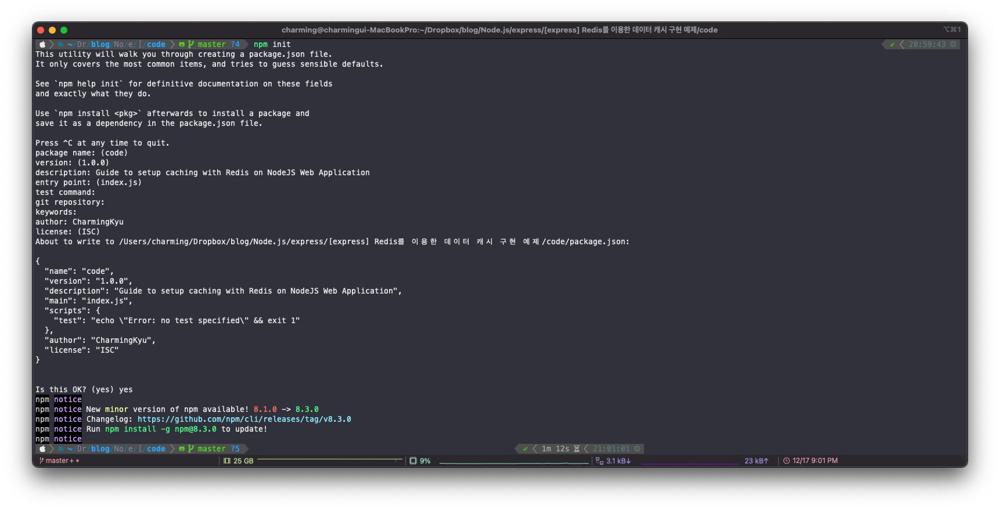
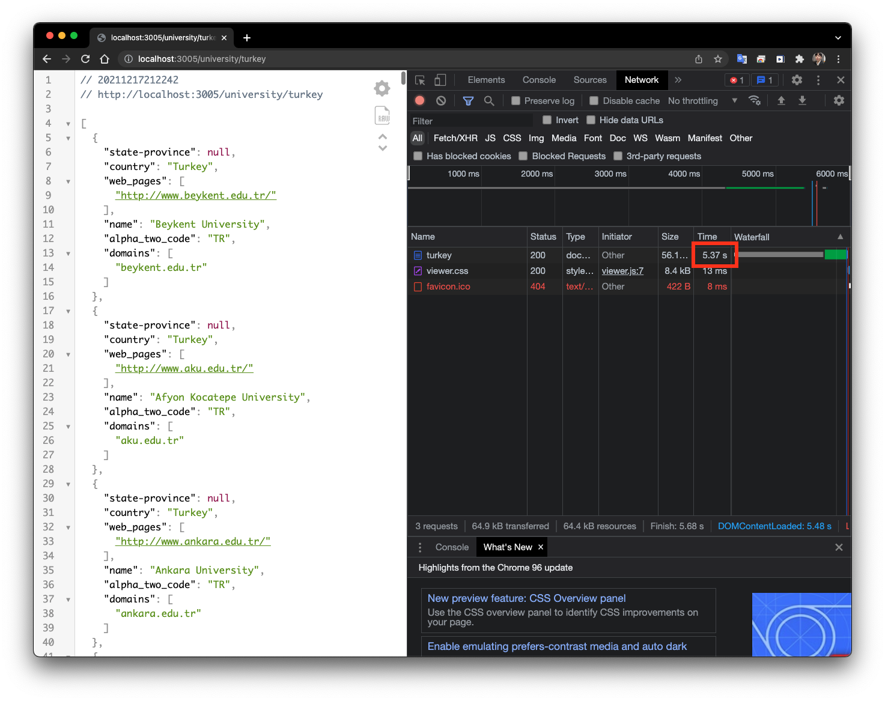

## 들어가며

웹 어플리케이션에서 데이터를 캐시하는 것은 매우 중요하며 고성능을 얻을 수 있습니다.물론 데이터를 관계형 데이터베이스에 저장 후 직접 쿼리하여 사용자에게 제공할 수 있지만 매 요청마다 쿼리를 해야하거나 메인페이지에 사용되는 타 API에 비해 상대적으로 많이 호출되는 데이터들은 캐시하는 것이 유리할 수 있겠습니다. 먼저 간단히 Redis에 대해 알아보고 express로 구현 예제를 작성하겠습니다.

## Redis란?

**REDIS(REmote Dictionary Server)**는 메모리 기반의 “키-값” 구조 데이터 관리 시스템이며, 모든 데이터를 메모리에 저장하고 조회하기에 빠른 Read, Write 속도를 보장하는 비 관계형 데이터베이스입니다.

-   대표적으로 5가지의 데이터 형식으로 사용 가능합니다.

1.  String
2.  Lists
3.  Sets
4.  Sorted sets
5.  Hashs

Redis는 빠른 오픈 소스 인 메모리 **키-값** 데이터 구조 스토어이며, 다양한 인 메모리 데이터 구조 집합을 제공하므로 사용자 정의 애플리케이션을 손쉽게 생성할 수 있습니다.

#### 장점

-   리스트, 배열과 같은 데이터를 처리하는데 유용
-   value 값으로 다양한 데이터 형식을 지원하기 때문
-   리스트형 데이터 입력과 삭제가 MySql에 비해 10배정도 **빠르다.**
-   여러 프로세스에서 동시에 같은 key에 대한 갱신을 요청하는 경우, 데이터 부정합 방지 Atomic 처리 함수를 제공한다(원자성).
-   메모리를 활용하면서 영속적인 데이터 보존(Persistence)스냅샷 기능을 제공해 메모리 내용을 \*.rdb 파일로 저장하여 해당 시점으로 복구할 수 있다.
-   AOF : Redis의 모든 Wirte/Update 연산을 log 파일에 기록 후 서버 재시작 시 순차적으로 재실행, 데이터 복구
-   명령어로 명시적 삭제, expires를 설정하지 않으면 데이터가 삭제되지 않는다.
-   1개의 싱글 쓰레드로 수행되기 때문에, 서버 하나에 여러개의 Redis Server를 띄울 수 있다.(Master-Slave 구조)
-   master-slave 간의 복제는 **non-blocking**

#### 단점

-   **메모리 파편화**가 발생하기 쉽습니다.
    -   메모리를 **2배**로 사용합니다.
    -   Redis는 **싱글 쓰레드**이기 때문에 스냅샷을 만들 때 자식 프로세스를 하나 만들낸 후  
        새로 변경된 메모리 페이지를 복사해서 사용합니다.
    -   Redis는 **copy-on-write 방식**을 사용합니다.
    -   보통 Redis를 사용할 때는 데이터 변경이 잦기 때문에 실제 메모리 크기만큼 자식 프로세스가 복사합니다.  
        그래서 실제로 필요한 메모리 양보다 **더 많은 메모리**를 사용하게 됩니다.

**In-memory(휘발성)** 방식이기 때문에 장애 발생시 데이터 유실이 발생할 가능성이 있습니다.

> 따라서 중요한 데이터를 Redis에 저장하는 것 보다 관계형 데이터베이스에 있는 데이터를 **빠른 응답을 위해 캐시**하는 용도가 적합합니다. 그리고 데이터 보존을 위해 스냅샷과 AOF 기능을 통한 복구 방식을 주의해서 작성해야 데이터 유실에 대비할 수 있습니다.

## 예제

오늘 만들어볼 예제는 [university-domains-list](https://github.com/Hipo/university-domains-list) 를 이용하겠습니다. 이 공개 API는 터키에 있는 대학교를 제공해줍니다.

> [http://universities.hipolabs.com/search?name=university&country=turkey](http://universities.hipolabs.com/search?name=university&country=turkey)

위 주소는 터키의 대학교 리스트를 JSON으로 내어주는 API 엔드포인트입니다. 우리가 만들어볼 서버는 NodeJS 웹 어플리케이션에 기본적인 데이터 캐시로직을 구현해 보겠습니다.

우리의 서버는 간단한 로직을 가집니다. 클라이언트로 부터 요청을 받으면 먼저 위 공개 API 주소로 요청을 보내 결과를 받고 그대로 클라이언트에게 전달하는 로직을 구현할 예정입니다.

**하지만 매 요청마다 공개 API에 요청을 보내고 받고, 받은 결과를 클라이언트에게 전달하는 것은 빠른 응답을 한다고 보기는 힘듭니다.**

그래서 공개 API로 부터 한번 응답은 받은 경우 **결과를 Redis에 저장 후 24시간 동안**은 공개 API에 요청 없이 **Redis에서 데이터를 꺼내어** 클라이언트에게 전달하겠습니다.

### Redis 설정

로컬에 이미 Redis가 설치되어 있으면 이 단계를 건너뛰어도 됩니다!

#### Mac

Redis는 Homebrew를 사용하여 Mac에 설치할 수 있습니다 . Mac에 Homebrew가 설치되어 있지 않은 경우 터미널에서 다음 명령을 실행하여 설치할 수 있습니다. 먼저 Homebrew를 다운로드 하겠습니다.

```
/usr/bin/ruby -e "$(curl -fsSL https://raw.githubusercontent.com/Homebrew/install/master/install)"
```

이제 간단한 명령으로 Redis를 설치할 수 있습니다.

```
brew install redis
```

#### ubuntu

우분투는 [이 가이드](https://www.digitalocean.com/community/tutorials/how-to-install-and-secure-redis-on-ubuntu-18-04)를 읽어보시면 Redis를 설치할 수 있습니다.

#### Window

윈도우는 [이 가이드](https://redislabs.com/blog/redis-on-windows-8-1-and-previous-versions/)를 읽어보시면 Redis를 설치할 수 있습니다.

### Redis 시작

터미널에서 다음 명령을 실행하려 Redis 서버를 로컬로 시작할 수 있습니다.

```
redis server
```

Redis CLI에 접근하려면 다음 명령을 실행합니다.

```
redis-cli
```

CLI를 이용하여 Redis와 인터렉션을 할 수 있지만, 이번 글은 NodsJS 웹 어플리케이션용 캐싱 설정하는 데만 집중하겠습니다. 더 궁금하신 분은 [Redis CLI](https://itnext.io/learn-to-cache-your-nodejs-application-with-redis-in-6-minutes-745a574a9739#:~:text=%EC%9E%91%EC%9A%A9%ED%95%A0%20%EC%88%98%20%EC%9E%88%EC%8A%B5%EB%8B%88%EB%8B%A4.-,Redis%20CLI,-%EC%97%90%EC%84%9C%20%EC%9D%B4%20%EA%B0%80%EC%9D%B4%EB%93%9C%EB%A5%BC)에서 가이드를 확인하시면 좋습니다.

### NodeJS 프로젝트 설정

별도의 폴더에서 **npm init** 을 실행 하여 프로젝트를 설정합니다.



그리고 시작 명령 등록을 위해 package.json에 아래와 같이 script를 추가합니다.

```
{
  ...
  "scripts": {
    "start": "node index"
  },
  ...
}
```

#### 종속성 설치

공개 API에 요청을 보내기 위한 `axios`와 Redis에 연결하기 위해 `redis` 의존성을 설치합니다.

```
npm i redis axios
```

다음은 `index.js`를  만들어 아래와 같이 수정합니다.

```
// 의존성 설정
const express = require('express');
const redis = require('redis');
const axios = require('axios');
const bodyParser = require('body-parser');

// 서비스 포트 선언
const port_redis = 6379;
const port = 3005;

// Redis 포트를 6379로 설정
const redis_client = redis.createClient(port_redis);

// express 서버 설정
const app = express();

// Body Parser 미들웨어
app.use(bodyParser.urlencoded({ extended: false }));
app.use(bodyParser.json());

// express 서버를 3005번 포트로 실행;
app.listen(port, () => console.log(`Server running on Port ${port}`));
```

### 공개 API에 요청을 보내기 위한 서버 엔드포인트 설정

이제 프로젝트 설정이 완료되었으니 공개 API에 GET 요청을 보내 터키 대학교 데이터를 가져오도록 엔드포인트를 작성해보겠습니다.

아래의 내용을 index.js에 추가합니다.

```
//  [GET] /university/turkey
app.get('/university/turkey', async (req, res) => {
    try {
        const universityInfo = await axios.get('http://universities.hipolabs.com/search?name=university&country=turkey');

        // response에서 data 가져오기
        const universityData = universityInfo.data;

        return res.json(universityData);
    } catch (error) {
        console.error(error);
        return res.status(500).json(error);
    }
});
```

이제 해당 엔드포인트를 실행해 보겠습니다.



요청은 잘 받았습니다! 하지만 개발자 도구를 확인해보니 요청을 응답받는데 까지 **5초**나 걸렸습니다. 사실 실제 웹페이지가 불러와지는데 5초이상 걸리게 된다면 저였으면 바로 이탈할 것 같습니다. 바로 이런 이유 때문에 Redis를 사용하는 것입니다.

### Redis 캐싱하기

#### 캐시 추가

Redis는 key와 value 값 쌍으로 데이터를 저장하기 때문에 요청마다 유일한 데이터를 식별하기 위해 들어온 요청의 url을 키 값으로 데이터를 저장하겠습니다.

```
// Redis에 데이터 추가
redis_client.setex(id, 1440, JSON.stringify(universityData));
```

key는 id, 유효시간=1440(분), value는 JSON을 string으로 변환하여 저장합니다. 아래는 최종 코드입니다.

```
// 의존성 설정
const express = require('express');
const redis = require('redis');
const axios = require('axios');
const bodyParser = require('body-parser');

// 서비스 포트 선언
const port_redis = 6379;
const port = 3005;

// Redis 포트를 6379로 설정
const redis_client = redis.createClient(port_redis);

// express 서버 설정
const app = express();

// Body Parser 미들웨어
app.use(bodyParser.urlencoded({extended: false}));
app.use(bodyParser.json());

// 캐시 체크를 위한 미들웨어
checkCache = (req, res, next) => {
  redis_client.get(req.url, (err, data) => {
    if (err) {
      console.log(err);
      res.status(500).send(err);
    }
    // Redis에 저장된게 존재한다.
    if (data != null) {
      res.send(data);
    } else {
      // Redis에 저장된게 없기 때문에 다음 로직 실행
      next();
    }
  });
};

//  [GET] /university/turkey
//  미들웨어 추가
app.get('/university/turkey', checkCache, async (req, res) => {
  try {
    console.log(req.url)
    const universityInfo = await axios.get('http://universities.hipolabs.com/search?name=university&country=turkey');

    // response에서 data 가져오기
    const universityData = universityInfo.data;
    await redis_client.setex(req.url, 1440, JSON.stringify(universityData));

    return res.json(universityData);
  } catch (error) {
    console.error(error);
    return res.status(500).json(error);
  }
});

// express 서버를 3005번 포트로 실행;
app.listen(port, () => console.log(`Server running on Port ${port}`));
```

위 처럼 미들웨어 형태로 만들어 매 요청마다 자동으로 캐시가 있는지 체크하여 Redis에서 값을 꺼내어 주는 로직을 작성하였습니다.

## 결론

이 튜토리얼은 단지 구현적인 부분만 집중을 했습니다. 레디스의 장점은 굉장히 빠르다는 점입니다. 단점은 데이터가 항상 정확하게 유지됨을 보장하지는 않는다는 것입니다. 따라서 유지되면 좋긴 하지만 날아가도 서비스 자체에 큰 지장이 없는 데이터를 저장하는 게 좋습니다. 하지만 Redis가 제공하는 기능을 사용함으로써 얻는 이점이 너무 많습니다. 시간이 되신다면 꼭 [공식 문서](https://redis.io/documentation)를 확인하는 것이 좋을 것 같습니다.
