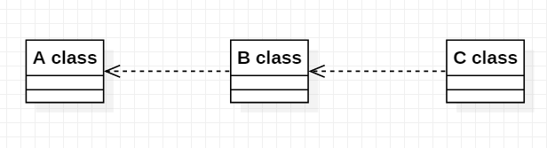
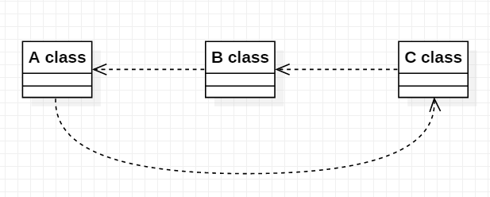

# 의존관계

객체지향 프로그래밍에서 한 객체가 다른 객체를 사용한다는 것은, 다른 객체를 생성하거나 다른 객체의 메소드를 호출하는 행위를 말한다. 이와 같이 한 객체가 다른객체를 생성 또는 메소드를 호출할 때, 그 객체에
의존한다고 표현한다.

```ts
abstract class Weapon {
  public abstract attck(): void;
}

class Sword implements Weapon {
  attck(): void {
    console.log('Sword');
  }
}

class Player {
  private weapon: Weapon;

  availWeapon(): void {
    this.weapon = new Sword();
    this.weapon.attck(); // Sword
  }
}
```

위 예제를 보면 `Player`는 `Weapon`을 생성하여 `attack`이라는 메소드를 호출하고 있으므로 `Weapon`에 **의존**한다고 볼 수 있다. 또한 매개변수로 전달 받는 경우에도 해당 파라미터에 대해
의존한다고 볼 수 있다. 의존성을 가진다는 것은 의존하고 있는 객체의 코드가 변경됐을 때 그 객체를 의존하는(이용하는) 객체도 변결될 가능성이 있다는 것을 의미한다. 이렇게 의존성을 가지게 되면 변화에 유연하지 못한
구조를 가진 프로그램이라고 할 수 있다.


위 그림처럼 C는 B를 의존하고 B는 A를 의존하고 있는 관계를 가정한다면 A클래스의 변경은 B클래스의 영향을 줄 수 있고, B클래스의 영향이 다시 C클래스에 영향으로 이어질 수 있다.


위 그림은 의존이 순환하는 구조인데 A클래스의 변화가 C클래스에 영향을 줄 수 있고, C클래스의 변화가 다시 A클래스의 영향으로 이어지게 되며 결국 A클래스의 변화에 대한 영향이 자기 자신에게 또 다른 영향을 줄 수
있다. 이러한 순환 의존 관계를 발생하지 않도록 하는 원칙이 하나 있는데 바로 **의존 역전 원칙(Dependency Inversion Principle: DIP)**라고 한다.

결론적으로 이러한 의존 관계를 가지게 되면 상호간에 영향을 줄 수 있다는 것이고, 즉 내가 변경되면 나를 의존하고 있는 코드들에 영향을 주게되는 것이고 새로운 요구사항이 들어왔을 때 하나의 변동사항이 그것을 의존하고
있는 클래스들에 영향을 줄 수 있다.

# 캡슐화

객체지향의 장점은 코드의 변경이 다른 코드에 영향을 주지 않도록 할 수 있고, 원할한 수정을 할 수 있는 구조를 가지는 것이 객체지향 프로그래밍이라 할 수 있다. 객체지향에서는 이러한 기능 구현사항을 **캡슐화**를
통해서 한 곳의 변화가 다른 곳에 영향을 주는 것을 최소화한다.

**캡슐화**란? 구현된 기능사항을 객체가 내부적으로 감추는 것이다. 구현 사항을 내부적으로 감춰 외부 객체 입장에서는 내부적인 기능사항이 변동되더라도 이 기능사항에 대해서 어떻게 구현되어 있는지 모르기 때문에
내부적으로 수정에 유연함을 가질 수 있다고 한다.

다음 예제는 헬스장 회원의 만료 날짜에 따라 입장 가능을 판별하는 `단말기`의 코드입니다. 절자지향적인 방식, 객체지향적인 방식으로 비교해 보겠습니다.

## 절차지향 방식

데이터베이스에서 회원의 만료 날짜를 가져와서 `expireDate`변수에 저장하였다고 가정하겠습니다. 회원의 만료시간을 확인 후 입장이 가능하면 `true`를 리턴하고 만료 되었으면 `false`를 리턴하는
요구사항입니다.

```ts
// .. DB를 조회하는 로직
// DB에서 회원의 만료 날짜를 가져와서 expireDate에 저장했다고 가정
const expireDate: Date;
if (!expireDate && new Date() > expireDate) {
  // 출입 불가능
  return false;
}

// 출입 가능
return true;
```

이렇게 만료 날짜를 조회하고 현재 시간과 비교하여 판별하는 서비스 로직을 구성하였습니다. 하지만 경영팀에서 헬스장에 여성이 많으면 매출이 증가한다는 사실을 알게되어 여성 회원일 경우 서비스 만료기간이 지났어도
30일은 더 이용 가능하도록 새로운 정책을 개발자에게 요구하였습니다. 그러면 개발자는 아래와 같이 코드를 수정하게 됩니다.

```ts
// .. DB를 조회하는 로직
// DB에서 회원의 만료 날짜를 expireDate에 성별을 gender에 저장했다고 가정
const expireDate: Date;
const gender: Gender;

if (!expireDate && new Date() > expireDate) {
  const now = new Date();
  if (gender === Gender.FEMALE && new Date(now.setDate(now.getDate() + 30)) > expireDate) {
    // 여성이고 만료이후 30일이 안지났으면 출입 가능
    return true;
  }
  // 출입 불가능
  return false;
}

// 출입 가능
return true;
```

뭔가 보기도 너무 힘든 코드가 됩니다. 하지만 여성분들에게 이런 서비스를 제공해보니 GX존이 꽉차게 되어 기존 회원들의 불만이 폭주합니다. 그래서 GX존 입구에 입출입 단말기를 하나 더 설치하여 30일 서비스 기간인
여성 회원은 헬스장 출입은 가능하지만 GX존 출입은 통제하고자 합니다. 그럼 위에 작성한 코드를 재활용할 수 있을까요? 제 생각에는 굉장히 힘들 것 같습니다. 만일 이러한 프로그램을 관리하는 개발자가 바뀌었다면 그
헬스장에게는 최악의 상황일 것입니다. 왜냐하면 위에서 작성된 코드는 해석하기 굉장히 힘들기 때문입니다. 이러한 데이터를 직접 사용하는 절차지향적인 구조의 코드는 데이터의 변화나 새로운 정책 요구사항에 대응하는데
유연하지 못 한 구조입니다.

## 객체지향 방식

위 코드의 만료기한 관련 정책을 검사하는 절차지향 방식을 객체지향 방식인 `캡슐화`를 이용하여 재구성 해보겠습니다. 먼저 클래스를 작성하겠습니다.

```ts
// 클래스 선언
class Member {
  private expireDate: Date;
  private gender: Gender;

  constructor(expireDate: Date, gender: Gender) {
    this.expireDate = expireDate;
    this.gender = gender;
  }

  isExpired(): boolean {
    return new Date() > this.expireDate();
  }

  isPossible(): boolean {
    return this.isExpired();
  }
}
```

아래는 `Member` 클래스를 사용하는 서비스 코드입니다.

```ts
// .. DB를 조회하는 로직
// DB에서 회원의 만료 날짜를 expireDate에 성별을 gender에 저장했다고 가정
const expireDate: Date;
const gender: Gender;
const member = new Member(expireDate, gender);

return member.isPossible();
```

만약 위와 같은 상황에서 똑같이 **여성 회원인 경우 30일 입장 가능**을 구현한다면 아래와 같이 클래스를 변경하겠습니다.

```ts
// 클래스 선언
class Member {
  private expireDate: Date;
  private gender: Gender;

  constructor(expireDate: Date, gender: Gender) {
    this.expireDate = expireDate;
    this.gender = gender;
  }

  isExpiredAfterDays(day): boolean { // 만료일에 day가 지났는지 여부
    const now = new Date();
    return new Date(now.setDate(now.getDate() + day));
  }

  isWomanBenefit(): boolean {
    return new Date() > this.isExpiredAfterDays(30) && this.gender === Gender.FEMALE;
  }

  isExpired(): boolean {
    return new Date() > this.expireDate();
  }

  isPossible(): boolean {
    return this.isExpired() || this.isWomanBenefit();
  }
}
```

단지 `Member`의 isPossible() 메소드의 구현부만 바꾸었을 뿐 이를 사용하는 서비스 코드는 수정할 부분이 없습니다. 즉 서비스 코드의 변화 없이 요구사항을 구현할 수 있습니다. 그럼 **또 다시 GX존
입구에 입출입 단말기를 하나 더 설치하여 30일 서비스 기간인 여성 회원은 헬스장 출입은 가능하지만 GX존 출입을 금지**하게 된다면 해당 단말기의 서비스 코드만 재작성하면 됩니다.

```ts
const expireDate: Date;
const gender: Gender;
const member = new Member(expireDate, gender);

return member.isExpired();
```

절차지향 방식의 코드보다 가독성 측면에서도 간결해졌습니다. 이렇게 캡슐화를 통해 정보를 은닉하고, 객체간의 결합도(의존성의 정도)가 낮아지고 응집도는 높아지게 되었습니다. 그리고 코드의 재사용성이 높아졌으며, 기능
수정사항에 대해 유연함을 가지게 되었습니다.
