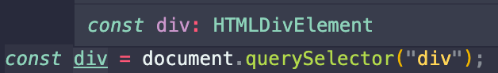

> 이 글은 인프런의 [TypeScript 입문 - 기초부터 실전까지](https://inf.run/EYCh) 강의를 듣고 정리한 글입니다.

## 타입 단언(Type Assertion)
```javascript
let z;
z = 20;
z = 'z';
let b = z; // b: any
let b = z as string; // b: string
```
세번째 줄 까지만 봤을 때, 결국 z는 마지막에 문자열 타입으로 인식이 되었을 것이라고 추론할 수 있지만, 실제로 프리뷰를 보면 any 타입으로 되어있다. 그래서 b도 any타입을 반환한다. 이렇게, 명확한 typing이 되지 않는 문제를 해결하기 위해서 맨 마지막 줄의

> let b = z as string

으로 z를 string type으로 단언해준 뒤 그것을 b에 부여하였다. 이 결과 b는 문자열 타입을 갖게 된다.


예시를 보자. 자바스크립트에서 사용하는 대표적인 DOM API중 하나가 querySelector인데, 이는 HTML에서 div 태그를 가진 것을 가져온다 라고 생각하면 된다. 아무튼, 이렇게 div 태그를 div라는 이름으로 가져온다면 이 div의 타입은, 위의 사진을 보면 알겠지만 HTMLDivElement로 타입스크립트 자체적으로 추론을 하고 있다.
```javascript
const div = document.querySelector('div');
if (div) {
console.log(div.innerText);
}
```
좀 더 엄격하게 타입 검사를 하는 경우에는 div의 타입이 HTMLDivElement | null(유니온 타입) 로, nullable한 경우도 존재를 하게 되는데, 이는 타입스크립트에서는 접근하는 시점의 document.querySelector이 돌아가는 위치에서 div가 있다는 보장을 해주지 않기 때문이다. 이러한 경우  위에 있는 코드처럼 div가 있는지 확인을 하고, 있으면 조작을 하는 것이 일반적이다.  이 경우에 타입 단언을 사용할 수 있다.
```javascript
const div = document.querySelector('div') as HTMLDivElement;
console.log(div.innerText);
```
이렇게, HTMLDivElement라고 타입 단언을 해준 뒤에는 div의 타입은 HTMLDivElement로 특정되고, 바로 아랫줄의 innerText를 사용할 수 있게 된다.


## 타입 가드(Type Guard)
```javascript
function introduce(): Developer | Person {
return { name: "sangmin", age: 26, skill: "TypeScript" };
}
const sangmin = introduce();
console.log(sangmin.skill);

if ((sangmin as Developer).skill) {
const skill = (sangmin as Developer).skill;
console.log(skill);
} else (sangmin as Person).age {
const age = (sangmin as Person).age;
console.log(age);
}

```

1. 유니온 타입(Developer | Person) 선언 후 그에 따른 object 형태 return
2. 이제 5번째 줄의 console.log(sangmin.skill); 에서 오류가 생긴다. 유니온 타입을 쓰게 되면 공통된 속성에만 접근할 수 있기 때문이다.
3. 그래서, 아래 if문과 같이 타입 단언을 Developer와 Person으로 각각 해준 뒤에 skill과 age가 있는지 확인하고 있으면 변수 부여를 한다음에 콘솔에 출력하는 방식이다.

이 방식은 효율성이 너무 떨어진다. 이런 상황에서 효율성 개선을 위해 타입 가드를 사용한다.

```javascript
function isDeveloper(target: Developer | Person): target is Developer {
return (target as Developer).skill !== undefined;
}

if (isDeveloper(sangmin)) {
console.log(sangmin.skill);
} else {
console.log(sangmin.age);
}
```
Developer.skill이 undefined가 아니면, 즉 Developer.skill이 있다면 target은 Developer가 된다 라고 생각하면 된다. 이렇게 할 경우 아래의 if문은 훨씬 간편해진다. isDeveloper의 진위여부로 Developer인지 Person인지 가릴 수 있다.

## 타입 호환
타입스크립트에서 특정 타입이 다른 타입에 잘 맞는지를 확인하는 과정을 타입 호환이라고 한다.
```javascript

interface Avengers {
name: string;
}

let hero: Avengers;
let capt = { name: "Captain", location: "Seoul" };
hero = capt
```
위 코드를 보면, capt는 hero 타입에 호환이 될 수 있다. 왜냐면 capt가 Avengers 인터페이스의 name 속성을 갖고 있기 때문이다. 따라서, capt는 Avengers 인터페이스와 호환이 되고, hero의 타입이 Avengers이기 때문에 두개가 호환이 되는 것이다.


### 타입 호환 예시: 인터페이스, 클래스
```javascript

interface Developer {
name: string;
skill: string;
}
interface Person {
name: string;
}

let developer: Developer;
let person: Person;

developer = person; // Property 'skill' is missing in type 'Person' but required in type 'Developer'.ts(2741)
person = developer; // OK
```
`developer = person` 을 하면 주석과 같은 에러가 생긴다. skill 속성이 Person 타입에 없는데, Developer 타입에서는 요구된다는 것이 그 내용이다.
이러한 에러가 발생하는 이유는, 왼쪽에 있는 타입(객체)이 더 큰 관계를 갖고 있기 때문이다. 기본적으로 타입 호환이라는 것은 오른쪽에 있는 타입이 더 많은 속성을 갖고 있거나 더 클 때 호환이 된다. person보다 developer이 더 큰 관계를 갖고 있으므로, 더 작은 것을 더 큰 것에 부여할 수 없다. 라고 생각하면 편하다.
그래서, person = developer을 하면 에러가 생기지 않는다.
```javascript

class Developer {
name: string;
skill: string;
}

class Person {
name: string;
}

let developer: Developer;
let person: Person;

developer = new Person(); // Property 'skill' is missing in type 'Person' but required in type 'Developerss'.ts(2741)
person = new Developer(); // OK
```
상기한 내용은 클래스에서도 마찬가지이다.

### 타입 호환 예시: 함수, 제네릭
```javascript

// 함수
let add = function (a: number) {
return a + 1;
};
let sum = function (a: number, b: number) {
return a + b;
};

add = sum; // sum에는 b가 있으므로 안됨. '(a: number, b: number) => number' 형식은 '(a: number) => number' 형식에 할당할 수 없습니다.ts(2322)
sum = add; // OK
```
이것도, 위에 인터페이스에서 말한 것과 다르지 않다.
```javascript

// 제네릭
interface Empty<T> {}

let empty1: Empty<string>;
let empty2: Empty<number>;
empty1 = empty2; // OK
empty2 = empty1; // OK

interface NotEmpty<T> {
data: T;
}

let notempty1: NotEmpty<string>;
let notempty2: NotEmpty<number>;
notempty1 = notempty2; // 'NotEmpty<number>' 형식은 'NotEmpty<string>' 형식에 할당할 수 없습니다. 'number' 형식은 'string' 형식에 할당할 수 없습니다.ts(2322)
notempty2 = notempty1; // 'NotEmpty<string>' 형식은 'NotEmpty<number>' 형식에 할당할 수 없습니다. 'string' 형식은 'number' 형식에 할당할 수 없습니다.ts(2322)
```
제네릭의 경우는 아주 조금 다른데, 제네릭을 부여한 인터페이스의 내부에 반환하는 값이 없다면 둘 다 호환이 가능하지만, 아래 NotEmpty처럼 그 제네릭을 사용하는 속성이 있을 때는, 제네릭에 부여한 타입이 다를 경우에는 예측할 수 있듯이 당연하게도 되지 않는다. 타입이 다르니까.

여러 가지 예시로 타입 호환을 알아봤는데, 중요한 것은 타입 호환은 오른쪽에 있는 타입(객체)이 더 많은 속성을 갖고 있거나 더 클 때만 가능하다는 점이다.
