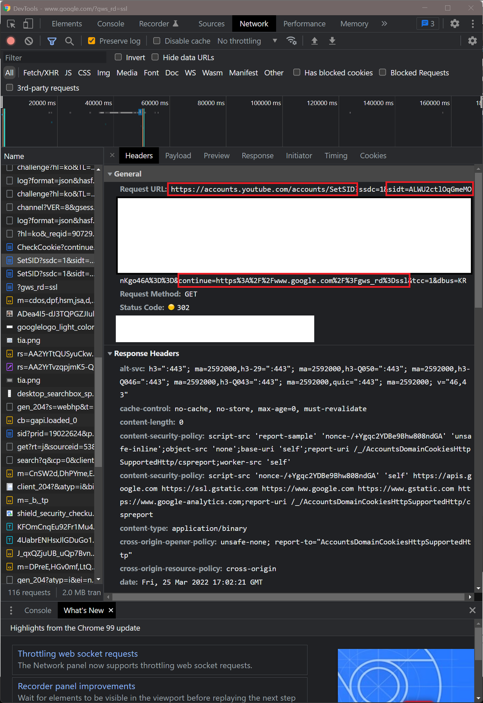

## 서론

회사 프로젝트 중 SSO 프로젝트에 참여하게 되었습니다.  
하지만 고민이 되는 지점이 있었습니다. 바로 서로 다른 도메인간 SSO(Single Sign On)을 구현해야 하는 점입니다.  
기본적으로 서버는 브라우저에 저장되어 있는 쿠키 값으로 사용자가 로그인 상태인지 확인합니다.  
(물론 JWT를 사용한다면, 브라우저 WebStorage에 저장하여 사용자를 구별하는 방법도 있습니다.)

브라우저에서 쿠키가 저장되는 영역은 도메인으로 나뉘기 때문에  
Cross domain간 어떻게 로그인을 유지할지 고민이 필요했습니다.  
사용자 플로우상 요구 사항은 아래와 같습니다.

#### **로그인**

1\. A.com 도메인에서 로그인을 수행한다.  
2\. 로그인을 수행하기 직전 엔드 포인트로 로그인이 완료된 상태로 돌아와진다.  
2\. B.com으로 이동시 A.com에서 로그인된 계정이 로그인 되어있어야 한다.

#### **A도메인 회원가입**

1\. A.com 도메인에서 회원 가입을 한다.  
2\. 회원가입 완료 후 A.com으로 돌아와지고 로그인이 되어있어야 한다.  
3\. B.com 도메인으로 이동시 A.com에서 회원가입한 계정이 로그인 되어있어야 한다.

#### **B도메인 회원가입**

1\. B.com 도메인에서 회원 가입을 한다.  
2\. 회원가입 완료 후 B.com으로 돌아와지고 로그인이 되어있어야 한다.  
3\. A.com 도메인으로 이동시 B.com에서 회원가입한 계정이 로그인 되어있어야 한다.

## Cross Domain

위 같은 요구사항을 확인 후 팀 내에서 나온 이야기는 아래와 같습니다  
google.com에서 로그인시 youtube.com에서도 동일한 구글 계정으로 로그인 되어 있는 현상을 발견했습니다.  
이후 저희의 고민과 비슷한 질문 글을 찾았습니다.

[How does Google achieve single sign-on between different domains such as YouTube and Gmail?](https://www.quora.com/How-does-Google-achieve-single-sign-on-between-different-domains-such-as-YouTube-and-Gmail)  

글의 답변을 정리하자면 아래와 같습니다.

> account.google.com 이라는 도메인에서 구글 로그인을 합니다.  
> 로그인이 완료된 직후 account.youtube.com/SetSID 라는 주소로 SID 값과 Redirect합니다.  
> account.youtube.com에서 쿠키를 심은 뒤, 최종적으로 사용자에게 보여줄 주소로 Redirect합니다.

## 검증

첨부되어 있는 질문글은 5년전에 작성된 글입니다.  
과연 구글은 현재에도 위 방식으로 SID을 공유하는지 검증이 필요할 것 같습니다.  
만약 현재는 방식으로 구현되어 있다면,  
왜 방식을 바꾸게 되었는지 한번 더 생각해볼 수 있을 것 같습니다.

실제 구글 로그인을 진행하여 youtube.com 이라는 도메인에 다른 요청을 보내는지 확인해보면 되겠습니다.  
로그인 상태에서 상단 URL을 보시면 로그인이 완료되면  
최종적으로 사용자를 Redirect 시킬 주소를 쿼리 값(continue)과 함께 로그인합니다.

**로그인 완료시 5년전 답변과 같게 accounts.youtube.com에 **SID 값을** 쿼리로 전달하였습니다.**  
그리고 continue라는 값으로 로그인 완료시 최종적으로 Redirect 시킬 주소를 포함하고 있습니다.  
해당 요청의 응답은 302 (Redirect) Status Code입니다.  
당연히 파라미터(continue)로 전달한 값을 Redirect 했을 것입니다.  

## 구현 방법

처음에 말씀드린 요구사항을 충족시키려면 아래와 같은 Flow가 되겠습니다.

## 결론

원래 일반적인 서비스 확장은 하나의 도메인에서 서브 도메인 형식으로 확장을 합니다.  
하지만 구글이 유튜브를 인수하게 되면서, youtube.google.com 이라는 주소로 확장하지 않고  
youtube.com의 도메인을 그대로 사용하기 위해 이러한 방식을 사용한 것 같습니다.

제가 맡은 프로젝트 또한 같은 고민을 하던 중  
5년전의 답변을 보고 깨달음을 얻었다는 사실에 놀랐지만  
더욱 놀라운건 구글이 유튜브를 2006년에 인수하였으니,  
구글 엔지니어는 이런 고민을 16년전에 했다는 사실에 굉장히 놀랐습니다.

이번 프로젝트는 회사간 합병, 인수 등  
경영과 관련된 큰 변화가 있어야만 할 수 있는 유니크한 경험이여서  
너무 재미있는 프로젝트입니다.