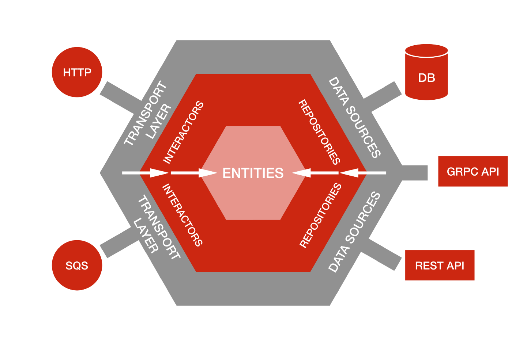
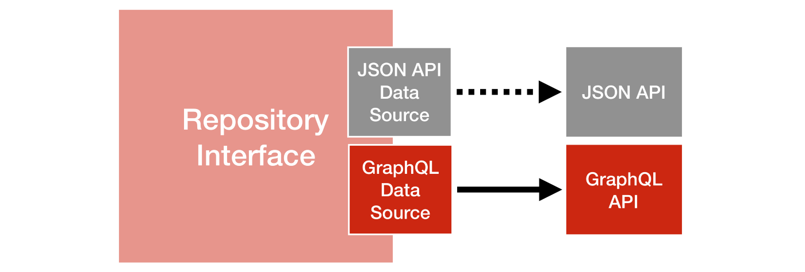

> 본 포스트는 Netflix 기술 블로그에서 발췌한 [Ready for changes with Hexagonal Architecture](https://netflixtechblog.com/ready-for-changes-with-hexagonal-architecture-b315ec967749) 게시글을 번역한 것입니다.

Netflix Originals의 제작이 매년 증가함에 따라 컨텐츠 제작 과정에서 효율성을 증가시키는 앱을 구축해야 할 필요성도 커지고 있습니다. 우리의 `Winder Studio Engineering` 팀은 컨텐츠 스크립트 획득, 거래 협상 및 공급업체 관리, 제작 절차 간소화 등 컨텐츠의 각본부터 제생에 이르기까지 제작을 돕는 수많은 앱을 구축했습니다.

# 처음부터 엄청난 통합
약 1년 전, Studio Workflow 팀은 비즈니스의 여러 도메인을 넘나드는 새로운 앱을 개발하기 시작했습니다. 우리는 흥미있는 과제를 가지고 있었습니다. 처음부터 어플리케이션의 핵심(core)을 만들어야 했고, 각기 다른 시스템에 있는 데이터도 필요했습니다.

영화, 제작일, 직원, 촬영지 등 우리가 필요한 데이터는 여러 프로토콜들로 흩어져 있었습니다. (gRPC, JSON API, GraphQL 등) 흩어져 있는 기존 데이터들은 어플리케이션의 동작과 비즈니스 로직에 매우 중요한 영향을 끼치기 때문에 우리는 꼭 시작부터 `통합(integrate)`할 필요가 있었습니다.

# 스왑 가능한 데이터
생산량 향상을 위한 초기 어플리케이션 중 하나는 모노리스(monolith)로 구축되었습니다. docker와 같은 container space에 대한 지식이 없는 동안 모놀리스는 빠른 발전과 빠른 변화를 가능하게 했습니다. 한때는 30명 이상의 개발자가 하나의 모놀리스 어플리케이션을 개발했고 300개가 넘는 데이터베이스 테이블이 있었습니다.

시간이 지남에 따라 어플리케이션의 서비스의 `영역`이 넓어지기 보다 `전문성`이 깊어지는 것으로 발전했고, 그 결과 모놀리스를 특정 서비스와 도메인 단위로 분해하기로 결정했습니다. 이러한 결정은 컴퓨팅 성능 문제에 의해 고려된 것이 아닌 도메인별로 나눈 모든 서비스를 배정한 담당 팀이 서비스를 `독릭적`으로 `전문성` 있게 개발할 수 있기 때문입니다.

새로운 어플리케이션에 필요한 대용량의 데이터는 여전히 모놀리스를 통해 제공받았지만, 모놀리스가 언제가 전부 분해될 것을 예상했습니다. 그 시기는 특정지을 수 없었지만 `대비`는 필요했습니다. 

이렇게 하여 여전히 모놀리스의 데이터베이스 중 일부를 활용해야 했지만, 마이크로 서비스가 시작되는 즉시 기존 데이터베이스를 교체할 수 있도록 준비할 수 있었습니다. 

# 육각형 설계의 영향력
**비즈니스 로직에 영향을 끼치지 않고 데이터베이스를 교체** 할 수 있는 기능을 지원해야 했습니다. 그러기 위해서는 먼저 **데이터베이스를 분리**해야 했습니다. 그래서 우리는 Hexagonal Architecture의 원리를 기반으로 어플리케이션을 구축하기로 했습니다.

육각형 설계의 아이디어는 입출력(API)을 우리 디자인 패턴의 가장자리에 배치하는 것입니다. 비즈니스 로직은 REST API 또는 GraphQL API 중 어느 것을 노출하느냐에 따라 달라져서는 안 되며, 데이터베이스, gRPC, REST를 통해 노출되는 마이크로 서비스 API, 단순 CSV 파일 등 어디에서 데이터를 얻느냐에 따라 달라져서는 안 됩니다.

이 패턴은 어플리케이션의 핵심 로직을 외부 관심사로부터 분리할 수 있게 해줍니다. 코어 로직을 분리하면 [코드베이스](https://ko.wikipedia.org/wiki/%EC%BD%94%EB%93%9C%EB%B2%A0%EC%9D%B4%EC%8A%A4)에 큰 영향을 미치거나 **중요한 코드를 수정하지 않고 데이터베이스 세부 정보를 쉽게 변경할 수 있습니다.**

또한 명확한 경계가 있는 어플리케이션을 사용하는 데 있어 얻는 주요 이점 중 하나는 **테스트**입니다. 대부분의 테스트를 쉽게 변경할 수 있는 **프로토콜에 의존하지 않고 비즈니스 로직을 검증할 수 있습니다.** 

# 핵심 개념 정의
육각형 설계를 활용하여 비즈니스 로직을 정의하는 세 가지 주요 개념은 **Entity, Repository 그리고 Interactors**입니다.
- **Entity**는 도메인 객체(예시로 동영상 촬영 위치)이며, Ruby on Rails의 Active Record 또는 Java Persistence API(JPA)와 달리 엔티티들은 자신들이 어디에 저장되는지 전혀 모릅니다.
- **Repository**는 엔티티를 만들고 변경하는 인터페이스입니다. 데이터베이스와 통신할 때 사용되는 메소드들을 보관하고 단일 엔티티 또는 엔티티 목록을 반환합니다. (예: UserRepository)
- **Interactors**는 도메인 행동을 조정하고 수행하는 클래스입니다. 이는 서비스 오브젝트와 유스케이스 오브젝트와 비슷합니다. 도메인 작업(예: 프로덕션 온보드)에 특화된 복잡한 비즈니스 규칙과 validation 로직을 구현합니다.

이러한 세 가지 주요 유형의 개체를 사용하면 데이터가 보관되는 위치, 비즈니스 로직의 트리거가 되는 방법에 대한 지식이나 관심사 분리로 비즈니스 로직을 정의할 수 있습니다. 비즈니스 논리의 바깥에는 다음과 같은 데이터 소스와 전송 계층이 있습니다.

- **데이터베이스(Data Sources)**는 서로 다른 스토리지 구현에 대한 어댑터입니다. SQL 데이터베이스(레일즈 또는 Java JPA의 액티브 레코드 클래스), 탄력적 검색 어댑터, REST API 또는 CSV 파일이나 해시 같은 간단한 것에 대한 어댑터일 수 있습니다. Repository는 데이터베이스 정의된 것을 메소드를 구현하고 데이터를 가져오거나 푸시하는 것을 구현합니다.
- 전송 계층은 비즈니스 로직을 수행하기 위해 interactor를 트리거할 수 있습니다. 우리는 전송 계층을 우리 시스템의 input으로 취급합니다. 마이크로서비스의 가장 일반적인 전송 계층은 HTTP **API 계층**과 요청을 처리하는 Controller입니다. 비즈니스 로직을 인터렉터에 추출함으로써 특정 전송 계층 또는 컨트롤러 구현과 결합되지 않습니다. 인터랙터는 컨트롤러뿐만 아니라 이벤트, 크론 작업 또는 명령줄에 의해 트리거될 수 있습니다.


Hexagonal Architecture의 의존성 그래프는 안쪽으로 이동합니다.
 
기존의 전통적인 계층 구조는 모든 의존성이 한 방향을 가리킵니다. 각각의 계층은 아래의 계층에 따라 쉽게 변하게 됩니다. 전송 계층(transport layer)은 인터랙터(intteractors)에 의존할 것이고, 인터랙터는 지속성 계층(persistence layer)에 의존할 것입니다.

반면에 Hexagonal Architecture에서 모든 의존성은 내부를 가리킵니다. 핵심 비즈니스로직은 전송 계층이나 데이터베이스에 대해 관심사가 분리되어 있습니다. 여전히 전송 계층은 인터랙터를 사용하는 방법을 알고 있습니다. 그리고 데이터베이스는 레파지토리 인터페이스를 준수하는 방법을 알고 있습니다.

이를 통해 다른 Studio 시스템의 불가피한 변경에 대비하고 있습니다. 그리고 필요할 때마다 데이터베이스 스왑 작업을 쉽게 수행할 수 있습니다.

# 데이터베이스 교체
데이터베이스를 교체해야 할 필요성이 예상보다 일찍 나타났습니다. 갑자기 모놀리스로 읽기 제약 조건에 부딪혔고 한 엔터티에 대한 특정 읽기를 GraphQL의 집합 계층(aggregation layer)에 노출된 새로운 마이크로서비스로 전환해야 했습니다. 마이크로 서비스와 모놀리스 모두 동기화 상태를 유지하고 동일한 데이터를 가지고 있어 한 서비스 또는 다른 서비스에서 읽어도 동일한 결과가 생성되었습니다.

**우리는 2시간만에 JSON API에서 GraphQL을 이용한 데이터베이스 읽기로 변경 할 수 있었습니다.**

우리가 그렇게 빨리 해낼 수 있었던 주된 이유는 Hexagonal Architecture 때문이었습니다. 지속성 계층(persistence layer)의 세부 사항이 비즈니스 로직에 누출되지 않도록 했습니다. Repository 인터페이스를 구현한 GraphQL 데이터베이스를 만들었습니다. 다른 데이터베이스에서 읽기 시작하는 데 필요한 것은 **간단한 코드 한 줄 변경**뿐이었습니다.


적절한 추상화를 통해 데이터베이스를 쉽게 변경할 수 있었습니다.

그 점에서 우리는 **Hexagonal Architecture가 우리에게 효과적**이라는 것을 알았습니다.

간단한 코드 한 줄 변경의 가장 큰 장점은 릴리스에 대한 위험을 완화한다는 것입니다. 코드 배포 후 마이크로 서비스가 fail 할 경우 롤백이 매우 쉽습니다. 또한 configuration 한 줄 변경을 통해 사용할 데이터베이스를 결정할 수 있으므로 배포와 실행을 분리할 수 있습니다.

# 데이터베이스 세부 정보 숨기기
이 설계의 가장 큰 장점 중 하나는 데이터베이스 세부 구현 정보를 캡슐화할 수 있다는 것입니다. 우리는 아직 존재하지 않는 API 호출이 필요한 경우에 부딪혔습니다. 서비스에 단일 데이터를 fetch하는 API는 있었지만 대량의 데이터를 fetch하는 API는 구현되지 않았습니다. API를 제공하는 팀과 이야기해본 결과 이 엔드포인트를 제공하는 데 시간이 걸린다는 것을 알았습니다. 그래서 우리는 이 엔드포인트가 개발되는 동안 다른 솔루션으로 진행하기로 결정했습니다.

여러 레코드의 식별자가 주어지면 데이터를 가져오는 Repository 메소드를 정의했습니다. 그리고 데이터베이스에서 이 방법을 처음 구현했을 때 다운스트림 서비스에 여러 개의 동시 호출을 보냈습니다. 우리는 이것이 임시 솔루션이라는 것을 알았고 데이터베이스 구현의 두 번째 단계는 대량 API를 사용하는 것이라는 것을 알았습니다.


우리의 비즈니스 로직은 특정 데이터베이스에 제약이 없습니다.

이와 같은 설계 덕분에 많은 기술적 부채가 발생하거나 나중에 비즈니스 로직을 변경할 필요 없이 비즈니스 요구 사항을 충족하면서 앞으로 나아갈 수 있었습니다.

# 테스트 전략
Hexagonal Architecture로 실험을 시작했을 때 우리는 테스트 전략을 세워야 한다는 것을 알았습니다. 개발 속도를 높이기 위한 필수 조건은 신뢰할 수 있고 매우 빠른 테스트들을 갖추는 것이라는 것을 알았습니다. **우리는 테스트가 좋은 것이 아니라 꼭 있어야 한다고 생각했습니다.**

우리는 세 가지 다른 계층에서 앱을 테스트하기로 결정했습니다.

---

- 우리는 비즈니스 로직의 핵심이 존재하지만 어떤 유형의 지속성 또는 전송에서 독립적인 **interactors를** 테스트합니다. 우리는 의존성 주입을 활용하고 모든 종류의 Repository의 상호 작용을 mocking했습니다. 여기에서 **비즈니스 로직이 상세하게 테스트**되며, 이러한 테스트들이 우리가 가장 많이 수행하려고 애쓰는 테스트입니다.
---

- 우리는 **데이터베이스**를 테스트하여 다른 서비스와 올바르게 통합되는지, Repository 인터페이스를 준수하는지, 오류 발생 시 어떻게 동작하는지 확인합니다. 우리는 이 테스트의 양을 최소화하려고 노력했습니다.
---

- **통합 테스트**는 Transport/API 계층에서 interactors, Ropository, 데이터베이스를 거쳐 다운스트림 서비스에 이르는 전체 스택을 테스트합니다. 이 테스트는 모든 것을 올바르게 `연결`했는지 여부를 테스트합니다. 데이터베이스가 외부 API인 경우 해당 엔드포인트에 도달하고 응답을 기록했고(그리고 git에 저장) 테스트들이 빠르게 실행할 수 있도록 했습니다. 우리는 이 계층에 대해 광범위한 테스트 범위를 수행하지 않았습니다. 일반적으로 도메인 작업당 하나의 성공 시나리오와 하나의 실패 시나리오만 테스트했습니다.
---
Repository는 데이터베이스를 구현한 단순한 인터페이스이기 때문에 테스트하지 않으며, 속성이 정의된 일반 Entity이므로 거의 테스트하지 않았습니다. 추가 메소드가 있는 경우 엔터티를 테스트했습니다. (지속성 계층을 건드리지 않고).

물론 우리가 의존하는 서비스를 건드리지 않고 [contract testing](https://docs.pact.io/#what-is-contract-testing)에 100% 의존하는 문제점이 있었습니다. 하지만 위의 방식으로 작성된 테스트를 실행하면 단일 프로세스에서 100초 동안 약 3,000개 테스트를 수행할 수 있었습니다.

모든 시스템에서 쉽게 실행할 수 있는 테스트로 작업하는 것은 멋진 일이며 우리 개발 팀은 기능고장 걱정 없이 작업할 수 있습니다.

# 결정을 미루다
위에서 작성한 전략은 데이터베이스를 다른 마이크로서비스로 교환하는 데 있어 유리합니다. 주요 이점 중 하나는 데이터를 어플리케이션 내부에 저장할지, 저장 방법 등에 대한 결정을 지연할 수 있다는 것입니다. 어플리케이션 기능에 따라 데이터베이스 유형을 결정할 수 있는 유연성도 챙길 수 있습니다. (RDB든 NoSQL이든)

그리고 프로젝트를 시작할 때 구축 중인 시스템에 대한 정보가 가장 적어도 할 수 있습니다. 우리는 프로젝트 정보에 대한 결정 부족으로인해 [패러독스로 이어지는 아키텍처](https://twitter.com/tofo/status/512666251055742977)에 갇히면 안 됩니다.

우리가 내린 결정은 현재 우리의 요구에 부합하며 우리가 빠르게 움직일 수 있게 했습니다. Hexagonal Architecture의 가장 큰 장점은 향후 바뀌게 되는 요구사항을 충족하기 위해 애플리케이션을 유연하게 유지한다는 것입니다.
```
│   app.js          # App entry point
└───api             # Express route controllers for all the endpoints of the app
└───config          # Environment variables and configuration related stuff
└───jobs            # Jobs definitions for agenda.js
└───loaders         # Split the startup process into modules
└───models          # Database models
└───services        # All the business logic is here
└───subscribers     # Event handlers for async task
└───types           # Type declaration files (d.ts) for Typescript
```
